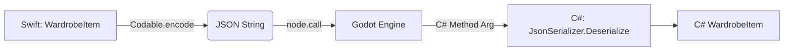

# 数据架构与跨语言交互指南 (Swift <-> Godot C#)

本文档详细说明了在 iOS 混合开发环境中，SwiftUI (宿主) 与 Godot (C# 脚本) 之间的数据交互策略、共用结构建议及职责边界划分。

## 1. 核心原则

由于 Swift 和 C# 运行在不同的运行时环境中（Swift Runtime vs .NET CLR），两者无法直接共享内存中的类实例。交互必须通过 **Godot Engine 的中间层** 进行，主要依赖 **Variant** 类型和 **序列化数据**。

*   **单一数据源 (SSOT)**: 建议将 **Swift** 侧作为核心业务数据的 "Source of Truth"（如用户库存、配置），Godot 侧仅作为 "View" 层负责渲染和即时交互，或维护临时的场景状态。
*   **通信桥梁**: 使用 Godot 的 `Call` (Swift -> Godot) 和 `Signal` (Godot -> Swift) 机制。

## 2. 推荐共用的数据结构

### 2.1 基础类型 (通过 Godot Variant 传递)
以下类型在 SwiftGodot 和 C# 之间转换开销极低，适合高频交互：
*   **String**: 传递 ID、路径、名称。
*   **Int / Float / Bool**: 传递状态标志、坐标值、进度。
*   **Vector2 / Vector3**: 传递位置、大小（Godot 内部类型在两端都有映射）。

### 2.2 复杂数据 (通过 JSON 序列化)
对于结构化对象（如 `WardrobeItem`），**不要尝试传递类实例**。
*   **推荐做法**: Swift 将对象序列化为 **JSON 字符串**，传递给 Godot；C# 接收后反序列化为本地 `struct` 或 `class`。
*   **理由**: 解耦两端的类定义，避免 ABI 兼容性问题，利用两端成熟的 JSON 库 (`Codable` vs `System.Text.Json`)。

**示例数据流**:


### 2.3 资源文件 (通过文件路径)
图片、纹理、音频等大文件 **不通过内存传递**。
*   **共用**: iOS 沙盒路径 (`user://` 映射到 `Documents` 目录)。
*   **做法**: Swift 将图片写入沙盒，仅将 **相对路径** (e.g., `"images/hat.webp"`) 传给 Godot。Godot 使用 `ResourceLoader.Load` 读取。

## 3. 数据职责划分 (分别管理)

### 3.1 Swift 侧 (业务逻辑与系统层)
**必须由 Swift 管理的数据**:
*   **持久化元数据**: `metadata.json` 的读写权限最好归属 Swift，防止并发写入冲突。
*   **系统级状态**: 相册权限状态、内购 (IAP) 商品列表及购买结果、推送通知 token。
*   **全局导航状态**: 当前 App 处于哪个页面（Home, Wardrobe, Shop），SwiftUI 的 `NavigationStack` 状态。
*   **原生 UI 数据**: 遮罩在 Godot 上方的 SwiftUI 控件状态（如设置面板、原生的 TabBar）。

### 3.2 Godot (C#) 侧 (表现层与交互层)
**必须由 C# 管理的数据**:
*   **场景图 (Scene Tree)**: 节点的层级关系、引用 (`Node`, `Sprite2D`, `Control`)。
*   **运行时渲染状态**: 材质实例、Shader 参数、粒子效果状态。
*   **瞬时交互状态**: 
    *   当前拖拽的物品偏移量 (`DragOffset`)。
    *   手势识别的中间状态 (Pinch 的 `InitialDistance`)。
    *   动画播放进度。
*   **资源缓存**: 已加载到显存的 `Texture2D` 对象池（避免重复 IO）。

## 4. 交互代码范例

### 4.1 Swift -> Godot (命令模式)
Swift 发送 JSON 数据更新 Godot 场景。

**Swift:**
```swift
// 假设已获取 Godot 场景的根节点引用 godotScene
struct OutfitData: Codable {
    let id: String
    let imagePath: String
}

func updateOutfit(item: OutfitData) {
    if let json = try? JSONEncoder().encode(item),
       let jsonString = String(data: json, encoding: .utf8) {
        // 调用 C# 定义的 "LoadOutfit" 方法
        godotScene.call(method: "LoadOutfit", args: [jsonString])
    }
}
```

**C#:**
```csharp
public partial class MainScene : Node2D
{
    public void LoadOutfit(string jsonString)
    {
        var data = JsonSerializer.Deserialize<OutfitData>(jsonString);
        var tex = GD.Load<Texture2D>($"user://{data.ImagePath}");
        GetNode<Sprite2D>("Character").Texture = tex;
    }
}
```

### 4.2 Godot -> Swift (事件模式)
Godot 触发交互，通知 Swift 处理业务（如点击保存）。

**C#:**
```csharp
[Signal] public delegate void OnItemSavedEventHandler(string itemId, string newDataJson);

public void SaveCurrentLook()
{
    var data = new { timestamp = DateTime.Now };
    string json = JsonSerializer.Serialize(data);
    // 发射信号，Swift 端可以监听
    EmitSignal(SignalName.OnItemSaved, "outfit_1", json);
}
```

**Swift:**
```swift
// 在初始化 Godot 视图时连接信号
godotScene.connect(signal: "OnItemSaved", callable: Callable(self, "handleSave"))

func handleSave(args: [Variant]) {
    let id = String(args[0])
    let json = String(args[1])
    print("Swift received save request for \(id): \(json)")
    // 执行 CoreData 保存或网络请求
}
```

## 5. 总结
*   **共用**: 基础类型 (Int/String), 文件系统路径, JSON 协议。
*   **Swift 独占**: 业务源数据, 系统 API, 原生 UI 状态。
*   **Godot 独占**: 渲染对象, 场景节点, 物理/动画状态。
*   **原则**: 让 Godot 做纯粹的“渲染器”和“交互器”，Swift 做“大脑”和“管家”。
