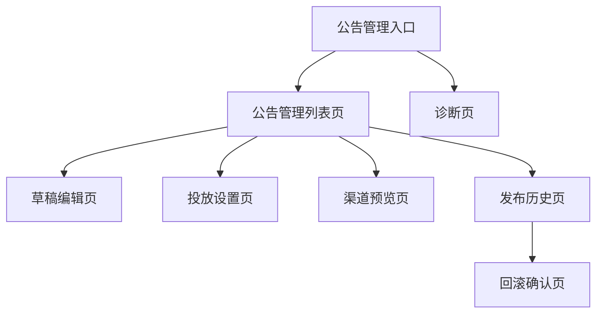

# 公告系统管理端信息架构（D 组前置文档）

> 更新时间：2026-04-06  
> 用途：定义公告系统在管理侧的页面结构、入口关系和主要操作流，作为管理前端和权限门控实现依据。

## 1. 目标

建立正式的管理闭环，让公告发布不再依赖实验室调试页面。

核心目标：

- 草稿、预览、发布、归档、回滚形成闭环
- 管理能力与诊断能力分离
- 角色权限边界可体现在页面结构上

---

## 2. 管理端页面树

---

## 3. 页面定义

### 3.1 公告管理列表页

职责：

- 统一查看 `draft / scheduled / published / archived`
- 提供筛选、搜索、状态切换入口

建议模块：

- 状态筛选栏
- 搜索栏
- 列表区
- 新建按钮

每条记录建议展示：

- 标题
- 当前状态
- 严重等级
- 渠道
- 发布时间/定时时间
- 更新时间
- 操作按钮

### 3.2 草稿编辑页

职责：

- 编辑内容主体

建议模块：

- 标题输入
- 摘要输入
- 正文输入
- 媒体配置
- 标签配置
- 动作配置

### 3.3 投放设置页

职责：

- 设置时间窗、渠道、受众、版本范围、环境

建议模块：

- `channel`
- `severity`
- `publishAt`
- `startAt`
- `endAt`
- `audience`
- `minAppVersion`
- `maxAppVersion`
- `requiresAck`

### 3.4 渠道预览页

职责：

- 预览 `inbox / banner / modal`

建议模块：

- 列表卡片预览
- banner 预览
- modal 预览

### 3.5 发布历史页

职责：

- 查看版本记录、发布记录、下线记录、归档记录

建议模块：

- 时间线
- 操作人
- 版本号
- 状态变更

### 3.6 回滚确认页

职责：

- 从历史记录复制/恢复为新草稿或执行回滚动作

### 3.7 诊断页

职责：

- 仅用于排查环境、权限、同步、Schema 问题

禁止：

- 直接作为正式发布入口

---

## 4. 管理主流程

### 4.1 新建发布流程

1. 进入管理列表页
2. 新建草稿
3. 编辑内容
4. 配置投放
5. 预览
6. 发布或定时发布

### 4.2 已发布公告调整流程

1. 管理列表进入已发布公告
2. 查看当前版本
3. 执行受限更新或下线
4. 自动记录审计

### 4.3 归档流程

1. 选择已发布或定时公告
2. 执行归档/下线
3. 公告进入历史记录

### 4.4 回滚流程

1. 进入发布历史
2. 选择历史版本
3. 执行回滚或复制为新草稿
4. 重新发布

---

## 5. 页面与角色映射

| 页面 | editor | publisher | admin |
|---|---|---|---|
| 管理列表页 | 是 | 是 | 是 |
| 草稿编辑页 | 是 | 是 | 是 |
| 投放设置页 | 是 | 是 | 是 |
| 渠道预览页 | 是 | 是 | 是 |
| 发布按钮 | 否 | 是 | 是 |
| 下线按钮 | 否 | 是 | 是 |
| 发布历史页 | 否 | 是 | 是 |
| 回滚页 | 否 | 否 | 是 |
| 诊断页 | 否 | 受限 | 是 |

---

## 6. 状态与页面联动

### 草稿态

- 可编辑
- 可预览
- 可进入发布流程

### 定时态

- 可修改时间
- 可取消定时
- 可立即发布

### 已发布态

- 可查看当前线上版本
- 允许受限修改
- 可下线

### 已归档态

- 默认只读
- 可复制为新草稿

---

## 7. 不推荐做法

以下做法禁止继续沿用：

1. 用实验室诊断页直接发布正式公告
2. 列表页不分状态，只显示混杂记录
3. 无预览直接上线
4. 已归档公告直接原地恢复，不走新草稿

---

## 8. 验收标准

- 管理端存在清晰的正式入口
- 内容编辑、投放配置、预览、发布、历史查看页面清晰分离
- 不同角色进入页面和看到的操作能力不同
- 诊断页与正式管理流程分离

---

## 9. 冻结结论

本管理端信息架构冻结以下共识：

1. 正式管理流程必须有独立页面体系。
2. 诊断页不是后台。
3. 生命周期和权限要在页面结构上直接体现。
