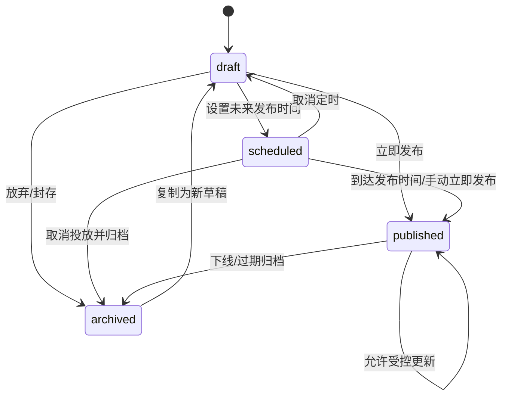

# 公告系统状态机（A2）

> 更新时间：2026-04-06  
> 对应任务：`NOTICE_CMS_DEV_TASKS.md` 中 A2  
> 用途：冻结公告生命周期状态机，作为前端按钮、服务层操作、CloudKit 状态流转的统一规则。

## 1. 状态定义

| 状态 | 含义 | 用户可见 | 可编辑 | 可发布 | 可归档 |
|---|---|---|---|---|---|
| `draft` | 草稿，内部编辑中 | 否 | 是 | 是 | 是 |
| `scheduled` | 已设定未来发布窗口 | 否 | 是 | 可转发布 | 是 |
| `published` | 已生效，对符合条件用户可见 | 是 | 受限编辑 | 是 | 是 |
| `archived` | 已下线或过期，供后台留存 | 否 | 受限编辑 | 可复制重发 | 是 |

---

## 2. 状态流转图

---

## 3. 状态流转规则

### 3.1 `draft -> scheduled`

条件：

- 已填写标题和正文
- 已配置合法的 `publishAt` 或 `startAt`
- 若配置跳转动作，`actionTarget` 必须有效

禁止：

- 空内容进入定时态
- 无时间窗口进入定时态

### 3.2 `draft -> published`

条件：

- 已通过发布校验
- 若 `publishAt` 为空，发布时自动写当前时间
- 默认将 `startAt` 补齐为 `publishAt`

### 3.3 `scheduled -> draft`

用途：

- 取消定时
- 回到内部编辑态

要求：

- 取消定时后保留内容与配置

### 3.4 `scheduled -> published`

触发方式：

- 到达 `publishAt`
- 管理端手动立即发布

要求：

- 状态切换必须写入实际发布时间

### 3.5 `published -> published`

用途：

- 对已发布公告做受控更新

规则：

- 允许修改展示文案、时间窗、动作配置
- 每次修改必须提升 `revision`
- 若更新影响用户理解，需重新评估是否触发再次提示

### 3.6 `published -> archived`

触发方式：

- 管理员手动下线
- 到达 `endAt`
- 内容过期

要求：

- 写入 `archivedAt`
- 用户侧列表不再显示
- 历史与审计仍保留

### 3.7 `archived -> draft`

说明：

- 不建议直接“恢复原记录”
- 建议“复制为新草稿”

原因：

- 避免历史记录与新投放混淆
- 便于回滚追踪和版本管理

---

## 4. 各状态允许的操作

| 操作 | draft | scheduled | published | archived |
|---|---|---|---|---|
| 编辑内容 | 是 | 是 | 受限 | 否 |
| 编辑投放时间 | 是 | 是 | 受限 | 否 |
| 编辑渠道 | 是 | 是 | 受限 | 否 |
| 预览 | 是 | 是 | 是 | 是 |
| 立即发布 | 是 | 是 | 否 | 否 |
| 下线 | 否 | 否 | 是 | 否 |
| 归档 | 是 | 是 | 是 | 已归档 |
| 复制为新草稿 | 是 | 是 | 是 | 是 |
| 回滚 | 否 | 否 | 是 | 否 |

说明：

- `published` 状态允许“受限编辑”，但必须写入审计日志并提升 `revision`
- `archived` 状态原则上只读

---

## 5. 发布校验规则

以下条件未满足时，不允许进入 `published` 或 `scheduled`：

1. `title` 为空
2. `content` 为空
3. `channel == modal` 但 `severity != critical`
4. `requiresAck == true` 但详情页未定义确认路径
5. `actionType != none` 但 `actionTarget` 为空
6. `endAt < startAt`
7. `environment` 与当前管理环境不一致

---

## 6. 自动状态变更规则

### 6.1 自动发布

- 当 `status == scheduled` 且当前时间达到 `publishAt` 或 `startAt` 时，进入 `published`

### 6.2 自动归档

- 当 `status == published` 且当前时间晚于 `endAt` 时，进入 `archived`

### 6.3 不自动恢复

- `archived` 状态不会因修改时间自动变回 `published`
- 如需重发，应复制为新草稿

---

## 7. 审计要求

状态流转必须记录：

- 操作前状态
- 操作后状态
- 操作人
- 操作时间
- 操作原因
- `revision`

---

## 8. 冻结结论

本状态机冻结以下共识：

1. 公告不是“直接改线上记录”，而是有生命周期的内容对象。
2. `draft / scheduled / published / archived` 是本系统最小状态集。
3. 发布与归档必须可追踪。
4. 已归档公告不直接恢复，统一走“复制为新草稿”。
