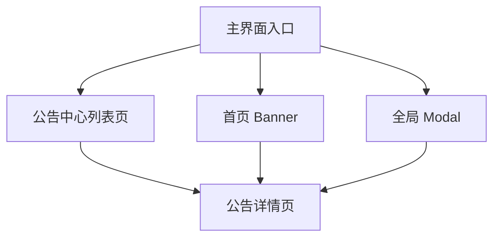

# 公告系统用户前端信息架构（C 组前置文档）

> 更新时间：2026-04-06  
> 用途：定义公告系统在用户侧的入口、页面关系、关键流转和展示优先级，作为公告中心、详情页、banner、modal 的前端实现依据。

## 1. 目标

建立用户侧稳定的信息架构，让公告系统不再依赖“最新一条弹窗”作为唯一触达方式。

核心目标：

- 公告中心成为正式主入口
- banner/modal 只是辅助触达渠道
- 用户随时能回到公告中心复查内容

---

## 2. 用户侧入口结构

建议用户侧保留以下入口层级：

1. 主入口：公告中心
2. 辅助入口：首页 banner
3. 强提醒入口：全局 modal
4. 状态提示：公告入口未读角标

规则：

- 所有公告最终都必须能回落到公告中心
- banner 和 modal 不得成为唯一入口

---

## 3. 页面树

---

## 4. 页面定义

### 4.1 公告中心列表页

职责：

- 展示所有当前有效公告
- 承接用户复查需求
- 提供未读态和重要程度区分

建议模块：

- 页面标题
- 列表筛选区
- 公告列表区
- 空态/加载态

建议字段展示：

- 标题
- 摘要
- 发布时间
- 重要程度标签
- 未读标记
- 封面图或媒体缩略图

### 4.2 公告详情页

职责：

- 展示公告完整正文与媒体
- 承接动作跳转
- 支持确认型公告完成状态

建议模块：

- 标题
- 发布时间
- 媒体区
- 正文区
- 动作按钮区
- 确认区

### 4.3 首页 Banner

职责：

- 承担轻提醒
- 引导进入详情页

建议模块：

- 标题/摘要单行展示
- 关闭按钮
- 点击进入详情

### 4.4 全局 Modal

职责：

- 承担关键公告强提醒
- 引导进入详情

建议模块：

- 标题
- 重点说明
- 主按钮
- 关闭按钮

规则：

- 不承载完整长文内容，完整内容仍在详情页

---

## 5. 用户主流程

### 5.1 主动查看流程

1. 用户进入公告中心
2. 浏览列表
3. 进入详情
4. 标记为已读
5. 如需确认，则点击确认

### 5.2 Banner 流程

1. 首页展示 banner
2. 用户点击 banner
3. 跳转详情
4. 详情页中标记已读/确认

### 5.3 Modal 流程

1. 满足规则时展示 modal
2. 用户点击主按钮进入详情，或关闭
3. 若关闭，则记录 `dismissed`
4. 若进入详情，则记录 `read`
5. 若详情中确认，则记录 `acknowledged`

---

## 6. 页面优先级与并发规则

### 同一时刻只允许一个主动提示层

优先级建议：

1. Modal
2. Banner
3. 仅公告中心未读角标

规则：

- 若当前命中 modal，则不同时展示 banner
- banner 不覆盖 modal
- 公告中心入口角标可长期存在

---

## 7. 列表分组建议

用户侧首版建议不做复杂 Tab，采用单列表 + 标签化视觉区分：

- 置顶公告
- 关键公告
- 普通公告

可选增强：

- “未读优先”筛选
- “仅重要公告”筛选

---

## 8. 列表状态建议

### 加载态

- 显示骨架屏或 loading

### 空态

- 文案：当前暂无公告
- 不显示误导性按钮

### 错误态

- 显示“加载失败，请稍后重试”
- 提供刷新能力

---

## 9. 详情页状态建议

### 普通公告

- 进入详情即标记为 `read`

### 确认型公告

- 进入详情不自动视为完成
- 只有点击“我已知晓”才标记为 `acknowledged`

### 已关闭提醒但未读详情

- 仍允许在公告中心中进入详情补读

---

## 10. 入口位置建议

建议用户侧在以下位置提供公告入口：

- “我”页固定入口
- 首页角标入口或消息入口

要求：

- 入口长期存在
- 不依赖管理员权限显示

---

## 11. 不推荐做法

以下做法不建议继续沿用：

1. 只有弹窗，没有公告中心
2. 关掉弹窗后找不到公告
3. 把调试页当成用户查看公告入口
4. banner/modal 中承载过长正文

---

## 12. 验收标准

- 用户能从固定入口进入公告中心
- 普通公告即使没有 banner/modal 也能被查看
- 关闭提示后仍能在公告中心复查
- 页面结构支持 `read / acknowledged / dismissed` 区分

---

## 13. 冻结结论

本信息架构冻结以下共识：

1. 公告中心是用户侧真主入口。
2. banner 和 modal 是辅助渠道。
3. 用户所有公告消费路径最终都应回到详情页和公告中心。
