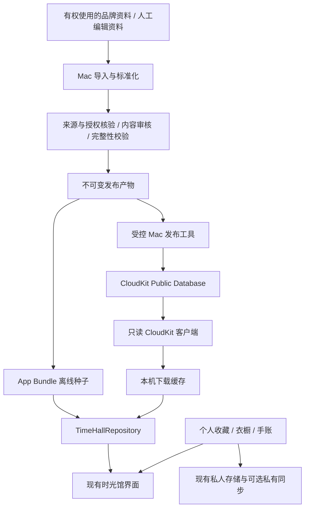

# Pink House：时光馆静态数据、CloudKit 公共内容库与本地缓存设计

> 文档版本：1.0 · 设计提案，尚未实施  
> 编写日期：2026-09-14  
> 项目：`dragon717/Pink_House`，iOS 主工程 `ItemManager`  
> 审查基线：读取时的 `main`，提交 `fa8b4392e5ca2c454657a5a51487e059a1baff8d`  
> 适用范围：梦裙时光馆、品牌图鉴及其运营内容分发；不将个人衣橱、照片、手账或其他个人资料纳入公共内容库。  
> 本文提供技术设计与审核风险分析，不构成法律意见或 App Store 审核通过保证。未访问实际 CloudKit Console、未检查生产库权限、未运行 Xcode 构建或真机测试。

---

## 0. 结论与决策摘要

**“Mac 生产静态内容 + App 内置离线数据 + CloudKit 按需补全 + 本地可清理缓存”是合理方向。应当调整的核心是：不让普通用户承担公共内容库的生产写入。**

推荐形成两个通道，而不是两类普通客户端写入者：

- **生产通道**：运维在 Mac 获取有权使用的资料，整理、校验、发布；同一份发布产物可以生成 App Bundle 数据，也可以直接进入 CloudKit Public Database。
- **消费通道**：普通用户先读本地，经版本清单确认需要更新时，再下载 CloudKit 中缺少或更新的数据；下载结果只进入自己的缓存。

公共库是**运营发布内容的在线分发源**，不是汇集每个人 App 内数据的“共享垃圾桶”。本地缓存可以清理，公共库的发布记录不能跟随用户清缓存被删除。

### 0.1 对原方案逐项判断

| 原方案 | 判断 | 本文采用的修正 |
|---|---|---|
| Mac 脚本生成 JSON 等静态数据 | 保留 | 增加来源、授权、校验、版本、回滚与发布记录 |
| 静态数据用于最新内容 | 有条件成立 | 随安装包的数据只能随 App 版本更新；日更内容应由 Mac 发布至在线库，而不是指望旧安装包自动变化 |
| 普通用户打开 App 自动上传已有静态数据 | 不作为正式方案 | 数据生产者直接发布一次，用户只读；搬运同一份内容不会自动降低公共库负载 |
| iCloud 白名单运维上传 | 保留“指定运维才能发布”的意图 | 权限必须落到可信发布工具及 CloudKit 服务端配置，不能只靠 Swift 数组隐藏按钮 |
| 本地没有当天、近三天或某品牌就查云端 | 保留按需补全，改写判定 | 除“有没有”外，还判断版本、覆盖范围、完整性、是否过期和是否被撤回 |
| 拉取内容作为本地缓存 | 保留 | 与个人资产物理隔离；支持失败回退、并发去重、空间上限与清理 |
| 公共库存全部数据 | 限定后保留 | 存全部**已获使用许可、审核通过、可公开发布**的数据；不存个人信息、内部审核材料或无权公开的原始资料 |

### 0.2 最小可行实现

第一版只需要：

1. 一条 Mac 内容发布流水线；
2. 三种 CloudKit Record Type：发布头、结构化数据包、媒体资源；
3. 一个本地文件缓存和一个统一读取 Repository；
4. 一个“清理时光馆下载缓存”的设置入口；
5. 普通用户对上述三种 Record Type **零写入权限**。

不需要为此先建设常驻业务服务器、开放投稿系统、分布式上传调度、复杂审核后台或全量 SwiftData 模型重构。

### 0.3 必须坚持的六条约束

- 只有运营发布链路能改变面向全体用户的内容。
- 用户个人内容绝不因“缓存优化”自动进入 Public Database。
- 数据合法性由来源与实际用途决定，不由“JSON”“缓存”“Mac 脚本”这些名字决定。
- 客户端本地有数据，也必须能够获知更正和撤回。
- 用户清理缓存不得删除收藏、衣橱、手账、图片原件或撤回控制状态。
- 云端不可用时，App 的衣橱等主要功能以及合法可用的离线内容仍然可用。

---

## 1. 项目现状：本方案如何接入实际工程

### 1.1 已确认的事实

当前主工程是 `ItemManager/`，README 标注使用 SwiftUI、SwiftData 和 CloudKit，最低系统 iOS 17.4。时光馆是衣橱与轻养成 App 的支撑模块，不是独立社区产品。[^R1]

| 已检查的路径 | 已存在的能力 | 对本次设计的意义 |
|---|---|---|
| `ItemManager/Services/TimeHall/TimeHallCatalogStore.swift` | `@MainActor` 单例；读取 Bundle JSON；内存图片缓存；收藏 ID 存在 UserDefaults | 可以保留 UI 外观接口，但需要抽离文件解析、校验、远端获取与缓存职责 |
| `ItemManager/Models/TimeHall/TimeHallModels.swift` | `TimeHallCatalogDTO` 及目录、商品快照、搭配、专题、事件、历史、批次等独立 DTO | 沿用业务实体，不把新闻、裙装、历史证据都压成一个通用投稿模型 |
| `tools/time_hall/README.md` | 分批导入流程；`content_batches.json` 管理内容批次；多个品牌与不同内容类型的 importer | Mac 静态内容生产并非从零开始，应在现有工具上追加发布阶段 |
| `tools/time_hall/import_news_batch.py` | 从官网解析 News，并写入 V3 事件与本地资源目录 | 已有离线生产的具体实现；需要收紧传输安全和发布校验 |
| `ItemManager/Services/NoticeCloudKitService.swift` | 使用 `iCloud.bugod2.ItemManager` 公共库；分页拉取；`desiredKeys`；iCloud 用户 ID 白名单 | 可借鉴分页、错误处理与容器配置，但不能照搬为时光馆权限体系 |
| `ItemManager/ItemManager.entitlements` | 声明 `iCloud.bugod2.ItemManager` 与 `iCloud.bugod2.SkirtMarket` | 优先在前者内建立独立 Record Type，不混入裙子股市数据结构 |
| `docs/TIME_HALL_CLOUDKIT_UPLOAD_PLAN.md` | 旧方案拟开放用户投稿，文档注明 V1 尚未实现上传 | 应明确标为被本方案替代，不能继续沿旧方案实现投稿功能 |

以上来自所列代码与项目文档；不是对所有 Target、所有网络调用或当前生产环境的完整审计。[^R2][^R3][^R4][^R5][^R6][^R7][^R8]

### 1.2 必须修正的现有细节

**A. 时光馆当前主要是 Bundle 加载，不是已经存在完整云缓存。**

`loadCatalog()` 从 Bundle 找到 `catalog.json`，使用 `Data(contentsOf:)` 解码。图片路径也优先搜索 Bundle。不能在计划里把“公共库增量同步、清缓存、下载补全”描述成已经实现。[^R2]

**B. 校验失败不能只依赖 `assert`。**

当前流程先执行 `catalog = decoded`，再根据校验结果打印日志并断言。设计上必须改成：先验证，通过后才切换为可展示数据。远端损坏的数据不能先进入 UI，再寄希望于调试断言兜底。[^R2]

**C. 单品牌整馆校验，不等于任意分片校验。**

现有校验含 `version == 3`、`1972...2026`、`2015...2026`、`brand == "PINK HOUSE"` 等特定条件。它们可以继续作为当前 PINK HOUSE 历史数据集的验收规则，但不能直接作为多品牌、每日空结果、云端增量包的通用契约。应分成通用结构校验、分片校验与品牌数据集规则。[^R2]

**D. 收藏不是缓存。**

当前 `treasuredIDs` 对应 UserDefaults key `timeHall.treasured.v1`。清缓存时必须保留它；后续更换 ID 方案需要显式迁移，不能让既有收藏失效。[^R2]

**E. 公共读取不必以用户登录 iCloud 为前提。**

现有公告服务在拉取前检查 `accountStatus == .available`。这可以是公告的历史产品选择，但新时光馆只读服务不应直接复制这一限制。Apple 的 `publicCloudDatabase` 文档说明公共库可在设备没有 iCloud 账户时访问，实际可读内容仍由数据库权限决定。[^R6][^A2]

**F. 运维白名单目前可见的是客户端判断。**

`isAdmin()` 使用 `container.userRecordID()` 与代码内 `adminIDs` 比较。本文未检查 CloudKit Console，不能据此认定生产库存在漏洞，也不能据此证明生产库安全。必须另外核实服务端 Record Type 权限。[^R6][^A3]

**G. 现有脚本有可直接修复的传输安全问题。**

已检查的 `import_news_batch.py` 使用 `ssl._create_unverified_context()`。新流水线应改为正常验证证书的 TLS 配置；证书或抓取失败应中止对应批次，不能以不验证证书维持发布成功。[^R5]

**H. 部分详情资源仍可能访问品牌站点。**

工具 README 写明：部分品牌封面随包，详情其他图片按需访问官方 HTTPS 地址。要实现“时光馆运行时只消费我们发布的数据”，还必须处理媒体分发，不是只把 JSON 放到 CloudKit 就完成迁移。这里只依据该文档识别待核查点，尚未逐个追踪详情 View 的实际调用。[^R4]

---

## 2. 审核、授权和 UGC：必须分开的四件事

### 2.1 Mac 采集与内容授权不是同一个问题

把采集工作从 iOS 移到 Mac，可以让正式 App 不承担采集职责，也便于限制频率、人工审核和统一发布。但它不会改变第三方图片、正文、商标及服务条款的使用边界。App Review 5.2、5.2.2 要求所用内容具有相应权利，第三方服务内容的使用符合许可条件。[^A1]

因此，本文设计的目标是**内容来源清楚、发布责任清楚、客户端行为真实可说明**，不是隐藏采集、绕过审核或把不明来源内容改名为缓存。

生产前须逐来源确认：允许获取什么、允许展示什么、能否重分发图片或全文、能否翻译、能否商业使用、覆盖哪些地区、授权何时失效。官网公开、保存来源链接、降低图片分辨率或获得卖货授权，都不能单独作为本 App 拥有重分发权的证明。

### 2.2 数据由谁上传，不等于内容由谁创作

需要区分三种情况：

| 行为 | 内容边界 | 本项目决策 |
|---|---|---|
| 运营整理并发布固定图鉴资料 | 运营对外提供内容 | 采用 |
| 普通用户原封不动搬运开发者预先发布的不可修改数据包 | 搬运者与内容作者不同；不能仅凭网络上传动作直接判定为用户创作 | 技术上可讨论，但收益有限，默认不采用 |
| 用户上传照片、评价、纠错正文、个人商品、搭配说明并供其他用户查看 | 产生新的用户对外内容 | 本期不做 |

Apple 对 UGC 的要求主要包括不当内容治理、举报、屏蔽滥用者和联系方式等。不能把“不叫投稿”“先审核”“存在 Public DB”作为自动豁免条件。[^A1]

为了减少歧义，本期对普通用户不提供任何影响公共内容的编辑、上传、投稿、发布或纠错直达公共库的能力。用户本地收藏与私人衣橱不属于这一公共发布链路。

### 2.3 “没有申请资质”需要按具体事项确认

本文不假设存在一张适用于所有 App 的统一“UGC 资质”。App Store 内容规则、当地备案、特定内容业务许可、第三方授权是不同层面。

Apple 的中国大陆上架说明列有适用 App 的 ICP 备案，以及游戏、出版物、宗教、新闻等内容可能涉及的额外材料。是否适用于本项目，需要根据真实内容、功能、运营主体和发行地区判断，不能靠换数据库消除。品牌站点栏目名为 `News`，也不足以单独判定 App 属于法律意义上的新闻业务。[^A5]

上线前应形成一份明确的“发行地区与材料确认表”，记录所需材料及确认责任人。未确认的高风险内容先不发布。

### 2.4 对审核和用户保持真实说明

正式 App 应真实地做到：运营内容只读；用户资料不自动公开；更新仅改变资料，不借数据包下载执行代码或开启未披露功能。审核说明应与实际二进制及服务端行为一致。[^A1]

不得保留“只对审核账号隐藏”的采集或投稿路径。内部生产工具与消费端分离，是产品与权限边界，不是审核伪装。

---

## 3. 数据所有权和可信边界

### 3.1 四类数据，四种生命周期

| 数据层 | 内容 | 可写者 | 清缓存是否删除 | 是否进入公共库 |
|---|---|---|---|---|
| 运营原始与审核资料 | 原始文件、授权凭证、编辑记录、待审草稿 | 运维 | 不适用 | 不进入公共可读区域 |
| 已发布内容 | 图鉴条目、品牌资料、经批准的媒体、发布清单 | 可信发布链路 | 不删除云端 | 是 |
| 用户本地公共内容副本 | 下载的 JSON、图片、解码索引、临时文件 | App 缓存服务 | 可以 | 不反向上传 |
| 用户个人资产 | 衣橱、照片、购买记录、手账、收藏、私人笔记 | 用户 | 不可以 | 不进入时光馆公共库 |

个人资产已有 iCloud 私有同步需求时继续走原业务的私有链路；不能复用公共内容模型或将私人数据关系挂到公共 Record 上。

### 3.2 两种“源”的职责

- **生产源**：运营本地的已审核结构化资料与发布产物，可重建线上内容。
- **在线分发源**：CloudKit 中当前对用户生效的已发布版本。

App Bundle 是某个已审核发布版本的离线快照；用户下载缓存是这个版本或更新版本的副本。只有发布工具可以将一份生产产物变成线上生效版本。

“所有数据最终在公共库”指所有有效、允许公开的发行数据，不包括所有抓取原文、所有内部历史版本和全部个人资料。

### 3.3 核心数据流



**图中故意没有“普通用户 → 公共库”的箭头。**

---

## 4. 日期、版本和实体身份

### 4.1 不用“新数据/老数据”决定存储类型

静态意味着内容在某个版本中不变，不意味着内容一定老旧。昨天生成的数据包也可以是静态包；十年前的资料今天被更正，也需要线上更新。

建议表达为：

- **离线种子**：随当前 App 安装包提供。
- **在线发布数据**：由运营持续发布，可能包含新内容、历史补充、更正和撤回。
- **本地下载副本**：缓存在线内容，按需回收。

### 4.2 至少区分四种时间

| 字段 | 含义 | 不得混用为 |
|---|---|---|
| `sourcePublishedAt` / `sourcePublishedOn` | 来源真实发布日期，允许未知 | 我们第一次抓取的日期 |
| `observedAt` | 本次采集或观察到该状态的时间 | 商品首次发售时间 |
| `publishedAt` | 本系统发布这个数据版本的时间 | 来源文章日期 |
| `checkedThrough` | 已检查来源至何时 | 数据必然覆盖所有历史的证明 |

现有 DTO 已区分部分 `publishedOn`、`observedAt`、`importedAt`，迁移时应保留含义，不把它们统一改成 `updatedAt`。[^R3]

商品价格、库存是观察快照；目录商品是历史展示；资讯事件按真实发布日期展示。页面应明确“资料更新于……”与“来源发布于……”，避免把重新抓取的老商品展示为今日新品。

### 4.3 “最近三天”的确定定义

本设计默认“今天、昨天、前天三个自然日”，不是滚动 72 小时。

按来源品牌配置 `sourceTimeZone`。日本官网资料初始采用 `Asia/Tokyo`；其他来源显式配置。用户显示时区可不同，但不能导致同一分片在不同时区客户端被映射成不同 ID。

例如该来源业务日期为 2026-09-14，则近三天为 2026-09-12 至 2026-09-14。使用 Calendar 的自然日加减计算边界，不以设备当前时区和固定减去若干秒替代业务日历。

### 4.4 版本不等于日期，也不等于 DTO 的 version

- `schemaVersion`：结构协议版本；现有 V3 需通过适配器读取。
- `releaseSeq`：运营发布序号，严格递增。
- `partitionRevision`：某分片修订号。
- `payloadHash`：发布数据包的内容摘要。
- `revocationEpoch`：撤回清单的单调递增版本。

当天可以发布多次；一条历史资料可以在今天修订。不能只用日期判断新旧。

### 4.5 稳定 ID 与旧收藏兼容

继续保留业务实体类型及已有 `id`、`canonicalKey`、`officialID`、`productCode` 等字段。新系统增加统一身份映射，不一次性重写现有 ID。

建议规范：

```text
canonicalEntityID = brandID / entityType / stableSourceID

示例：
pink-house / event / news-12345
pink-house / commerce-product / product-code-abc
angelic-pretty / commerce-product / source-product-xyz
```

这些是格式示例，不代表仓库中真实条目。

同品番跨品牌、同商品跨销售站点、目录展品与在售商品，不应因标题相同被合并。保持实体关系，必要时使用显式映射表关联。没有稳定来源 ID 时，先在运营侧建立可持久化映射；不能使用每次导入重生成的 UUID。

旧收藏 ID → 新身份的迁移应可重复执行；未能映射的收藏保留占位，不静默删除。

---

## 5. 分片与覆盖：不能把空数组当作缺数据

### 5.1 分片策略

以用户的实际浏览范围为单位，不一开始就每条商品一个云端请求。

| 内容 | 初始分片建议 | 说明 |
|---|---|---|
| 品牌基本信息 | 品牌 | 小且相对稳定 |
| 当前商品 | 品牌 + 当前快照 | 页面展示观察状态，不冒充全历史 |
| 历史目录 | 品牌 + 年份；过大再按季节 | 与现有目录关系一致 |
| 最近资讯 | 品牌 + 自然月，另附每日覆盖状态 | 一次下载可以满足近三天，避免大量极小文件 |
| 搭配、专题、品牌历史 | 品牌 + 类型；体积过大再按年份 | 保留现有 DTO 类型 |

**逻辑覆盖可以按天，物理数据包不必按天。**月包更新采用不可变新版本，客户端按包 hash 下载；后续只有在测量证明必要时才做条目级 delta。

首版可从“PINK HOUSE 一个资讯月包 + 一个商品快照包”开始验证，不立即迁移所有品牌和全部历史内容。

### 5.2 覆盖状态必须独立于条目数量

| 状态 | 含义 | 客户端行为 |
|---|---|---|
| `complete` | 声明范围已检查完，可能有条目 | 在新鲜度窗口内可直接使用 |
| `empty` | 已检查完，明确为零条 | 展示真实空态，不重复请求 |
| `partial` | 仅有部分资料或来源分页未完成 | 可展示已有内容，同时标注不完整 |
| `unknown` | 尚未检查或信息不足 | 按策略尝试补全 |
| `notSupported` | 运营当前不提供该范围 | 明确说明，不发起循环重试 |
| `withdrawn` | 该范围已撤回 | 不从旧缓存或 Bundle 恢复显示 |

`empty` 是有版本和检查时间的有效结果，不是永久结论。

来源请求失败、解析结构变化、权限不足、网络超时、CloudKit 查询失败，都不得转成 `empty` 或“没有最新资讯”。

### 5.3 “全量”必须标注边界

现有工具说明了部分品牌只导入官网仍可枚举的商品，不可能据实补造已删除、未公开索引的历史页面。新清单应保留此边界。[^R4]

建议增加：

```text
sourceCoverage = currentlyEnumerable | curatedSelection | historicalComplete
coverageDescription = 对用户可理解的范围说明
checkedThrough = 最近完成检查的时刻
```

没有可验证依据，不标记 `historicalComplete`；空缺本身也可以是被诚实记录的资料状态。

---

## 6. CloudKit 结构：首版只建三种 Record Type

> **⚠️ 2026-09-25 口径勘误（以实现为准）**
> 本节 §6.3 / §6.4 的 `THDataPack` / `THMedia` 字段名是**早期草案**，与后来落地的实现不一致。
> 权威口径 = `docs/TIME_HALL_CLOUDKIT_CONSOLE_SETUP.md` + `tools/time_hall/publication/`（`publish_cloudkit.py` 实际写入的字段）：
>
> | Record Type | 实际字段 |
> |---|---|
> | `THDataPack` | `partitionID`(String) `releaseSeq`(Int64) `sha256`(String) `byteCount`(Int64) `asset`(Asset) |
> | `THMedia` | `mediaKey`(String) `mimeType`(String) `sha256`(String) `byteCount`(Int64) `asset`(Asset) |
>
> 在 Console 建 Schema 时**必须**按上表，否则客户端 `desiredKeys` 解码失败。
> 另：本方案发布后新增了**商店目录整包分片**（时光馆「商店」内容，entityType = `shop-catalog`，
> brandID = `shaonv-xinyuan`，载荷键 `shopCatalog`），同样复用这三种 Record Type，
> 详见 `tools/time_hall/publication/README.md` 的「商店目录分片」一节。

### 6.1 容器与数据库

优先使用已声明的 `iCloud.bugod2.ItemManager`，调用 `publicCloudDatabase`；时光馆使用 `TH` 前缀独立 Record Type。不要复用 `Notice`、私人 `Clothing` 或 `iCloud.bugod2.SkirtMarket` 的业务 schema。[^R6][^R7][^R8]

CloudKit 公共库与私人库不是同一数据空间，公共数据计入 App 的公共库配额，而不是通过由哪个用户上传来转嫁给该用户的私人存储。公共库使用默认 zone；不要直接套用“按品牌创建自定义公共 zone”的设计。[^A2][^A3][^A4]

### 6.2 `THRelease`：唯一生效发布头

固定 Record ID，例如 `th.release.catalog-v1`。`catalog-v1` 是内容分发协议通道，不是 Xcode Debug/Release 标识。

| 字段 | CloudKit 类型 | 含义 |
|---|---|---|
| `releaseSeq` | Int64 | 单调递增发布序号 |
| `schemaVersion` | Int64 | 清单协议版本 |
| `publishedAt` | Date | 本系统发布时间 |
| `rootIndexHash` | String | 根清单文件 SHA-256 |
| `rootIndexAsset` | CKAsset | 根清单 JSON，列出分片及数据包引用 |
| `revocationEpoch` | Int64 | 撤回控制版本 |
| `minimumReaderVersion` | Int64 | 最小读取协议版本，不用于下载执行代码 |
| `previousReleaseSeq` | Int64 | 运维追踪信息 |

`recordChangeTag` 使用 CloudKit 自身的并发控制信息，不手工伪造。普通读取先仅取不含 Asset 的元数据，确认版本改变后才取根清单。

### 6.3 `THDataPack`：不可变结构化数据包

Record ID：`th.pack.<sha256>`。

| 字段 | 类型 | 含义 |
|---|---|---|
| `payloadHash` | String | 压缩文件字节摘要 |
| `encoding` | String | 初始限定 `json+gzip` |
| `schemaVersion` | Int64 | 数据包结构版本 |
| `compressedBytes` | Int64 | 声明压缩大小 |
| `uncompressedBytes` | Int64 | 声明解压大小，客户端另设硬上限 |
| `payloadAsset` | CKAsset | JSON 压缩数据 |
| `createdAt` | Date | 发布时间 |

同一 hash 对应同一字节内容；修订时建立新的包，不覆盖旧包。传输包中是纯数据，不含脚本、动态代码或可任意执行的表达式。

### 6.4 `THMedia`：已获许可的图片等资源

Record ID：`th.media.<sha256>`。

| 字段 | 类型 | 含义 |
|---|---|---|
| `contentHash` | String | 文件字节摘要 |
| `mimeType` | String | 白名单 MIME 类型 |
| `byteCount` | Int64 | 文件大小 |
| `pixelWidth` / `pixelHeight` | Int64 | 图片尺寸 |
| `asset` | CKAsset | 媒体文件 |
| `createdAt` | Date | 创建时间 |

封面与详情可以有不同压缩版本，各自用内容摘要标识。不得将 CloudKit 返回的临时资产下载地址当作永久业务 ID。

### 6.5 为什么首版不为每个实体建立 Record Type

现有 App 已消费结构化目录 JSON。采用数据包能复用该路径，以少量请求完成一个浏览范围的读取，减少跨多记录的发布一致性问题。

代价是单条更正可能重新下载一个小包，云端不适合直接对包内正文做查询。因此：分片大小需受控；本地做当前已下载范围的筛选。跨全站的大规模搜索是另一个能力，不能承诺“采用数据包后 CloudKit 自动全文搜索”。后续确有需求时再增加轻量搜索索引。

### 6.6 查询与索引约定

正常读链路使用已知 Record ID：

```text
THRelease 固定 ID
  → 根清单中的 THDataPack ID
  → 数据包中的 THMedia ID
```

优先显式批量 fetch，不先扫描整个 Public Database。仅为运维确实使用的条件建立相应 query/sort 索引。若后续使用 `CKQueryOperation`，必须处理全部 cursor、逐条失败及失败重试，不能把首个分页当作完整数据集。现有公告分页代码可作为实现参考。[^R6]

### 6.7 根清单示例

以下为协议样例，哈希和记录名为占位值，不是生产数据：

```json
{
  "schemaVersion": 1,
  "releaseSeq": 42,
  "publishedAt": "2026-09-14T03:00:00Z",
  "revocationEpoch": 3,
  "brands": [
    {
      "brandID": "pink-house",
      "sourceTimeZone": "Asia/Tokyo",
      "sourceCoverage": "currentlyEnumerable"
    }
  ],
  "partitions": [
    {
      "partitionID": "pink-house/events/2026-09",
      "brandID": "pink-house",
      "entityType": "event",
      "partitionRevision": 7,
      "coverageStatus": "complete",
      "checkedThrough": "2026-09-14T02:30:00Z",
      "dayCoverage": {
        "2026-09-12": "complete",
        "2026-09-13": "empty",
        "2026-09-14": "complete"
      },
      "packRecordName": "th.pack.<sha256>",
      "payloadHash": "<sha256>",
      "recordCount": 12,
      "dependencyPackRecordNames": []
    }
  ],
  "withdrawals": [
    {
      "canonicalEntityID": "pink-house/event/news-example",
      "withdrawnAt": "2026-09-14T02:00:00Z"
    }
  ]
}
```

关联完整性也要纳入发布：一个搭配条目引用商品时，应将依赖放在同包、随清单显式声明，或允许明确的“关联条目未下载”占位，不能因缺依赖让整页崩溃。

---

## 7. 权限：iCloud 用户 ID 不是发布密钥

### 7.1 三种身份不要混淆

| 名称 | 用途 | 能否当作权限本身 |
|---|---|---|
| CloudKit `userRecordID.recordName` | 在当前容器上下文识别用户 | 不能。知道某个 ID 不等于持有该用户权限 |
| 客户端 `adminIDs` | 决定内部工具显示、提示等体验 | 不能替代服务端拒绝未授权写入 |
| Server-to-server 私钥 / 受控管理凭证 | 可信发布工具认证 | 可以承载高权限，必须在受控环境保存 |

不要收集运维 Apple Account 密码，不把邮箱、用户 ID、API token、S2S 私钥统称为“iCloud key”。当前代码已有 `userRecordID` 识别思路，可保留为身份显示，不把它误当作密钥。[^R6]

### 7.2 推荐：Mac 直接使用受控发布凭证

Apple 文档明确支持脚本或服务器通过 server-to-server key 以管理员方式访问公共库。因此本项目不必为了运营上传先部署一台常驻服务器。[^A6]

要求：

- 运维凭证仅存受控 Mac 的 Keychain 或受限凭证存储，不进入仓库、App Bundle、JSON 包或公共记录。
- 开发与生产使用不同凭证配置和发布确认流程。
- 多人运维尽量使用可区分、可撤销的独立凭证，保留操作者与产物审计记录。
- 有效权限范围、撤销方法、负责人需要登记；不要假设高权限凭证天然细粒度到某个 Record Type。
- 生产发布前展示目标容器、环境、受影响品牌和条目差异；通过检查后再写发布头。

### 7.3 公共正式 Record Type 权限目标

下面是**需要在 CloudKit 服务端落实并验证的效果**，不是仅修改 App 的建议：

| 主体 | 读已发布内容 | 创建 | 更新 / 删除 |
|---|---:|---:|---:|
| 未登录 iCloud 的普通使用者，World 可读路径 | 是 | 否 | 否 |
| 登录 iCloud 的普通使用者，Authenticated | 是 | 否 | 否 |
| 普通记录创建者角色，Creator | 不额外授予写权限 | 否 | 否 |
| 受控发布工具 / 已配置的运维权限路径 | 是 | 是 | 是 |

不要给 `THRelease`、`THDataPack`、`THMedia` 的 `Authenticated` 或 `Creator` 留下默认写入权限，然后依赖“App 没有按钮”保证安全。CloudKit 公共库访问由服务端角色配置控制。[^A3][^A4]

若要让某些运维直接使用原生内部 App 上传，必须先证明当前控制台角色配置或可信服务端鉴权能仅授权这些账号。不能只复制 `adminIDs` 代码，也不能为使上传工作而开放所有登录用户写入。无法满足时，回到 Mac 受控发布方式。

本文未操作实际控制台，不声称已配置自定义角色，也不将某个未验证的控制台操作步骤作为上线前提。

### 7.4 旧方案中的 `pending / published` 不是安全隔离

旧文档设计了用户可写 `pending`、管理员变更 `published`，并提及 `Authenticated Write`。这种流程描述不能自动形成字段级权限；客户端查询 `status == published` 也不等于其他记录对客户端不可读。[^R8][^A4]

本期不提供用户投稿，因此直接不建设这条链路。未来真要做审核系统，应把待审资料放在独立、受限的存储中，由可信审核服务提升为正式数据；不能通过普通客户端可写的 `status` 字段控制发布权。

### 7.5 权限验收必须绕开 UI

使用普通账户的测试客户端，在拥有正常 App/容器访问条件下直接尝试：创建任意正式记录、覆盖发布头、改包内容、删除记录、伪造 `createdBy`。预期均被服务端拒绝。

同时验证：正常运维可发布；撤销凭证后不可再发布；开发环境权限正确不代表生产环境已经生效。

---

## 8. Mac 内容生产与发布流水线

### 8.1 复用现有导入器，而不是再写一套采集 App

保留 `tools/time_hall/` 中的目录、商品、搭配、专题、资讯、历史等 importer。现有 `content_batches.json` 继续管理导入批次；另外增加“审核通过的发布产物”，不要把完成抓取直接等同于批准公开。

建议新增目录，以下均为**待实现路径**：

```text
tools/time_hall/
  publication/
    sources.yaml                 # 来源、允许用途与责任人配置
    schema/                      # 发布清单、分片的数据契约
    build_release.py             # 标准化与分片打包
    validate_release.py          # 完整性、授权状态、体积和关系检查
    publish_cloudkit.py           # 上传包与媒体，最后切换发布头
    verify_publication.py        # 按普通读者视角回读验证
    rollback_release.py          # 新发布序号指向经过核验的旧内容
    README.md                    # 操作与故障恢复说明
```

若 Apple 提供的管理工具更适合团队环境，可通过发布适配层替换实现；不要把具体上传方式混入每个 importer。

### 8.2 生产步骤

```text
1. 选择来源与导入范围
2. 核对当前授权范围和有效期
3. 在临时目录获取原始资料
4. 标准化成现有实体 + 新发布元数据
5. 清理脚本、跟踪参数、无关个人资料和不允许公开的字段
6. 检查来源真实日期、价格单位、跨实体引用与重复 ID
7. 生成差异报告，由运维确认新增、修改、删除及异常下降
8. 审核通过，生成不可变数据包和媒体清单
9. 上传并回读验证全部新增依赖
10. 使用并发控制更新 THRelease
11. 以普通读者视角验收
12. 保存私有审计记录与可恢复产物
```

同一个审核通过的产物可以用于 CloudKit 和下一版 Bundle，不应分别加工两套内容造成不一致。首次上线前应先将需要在线补全的历史包发布完毕，再发布消费这些包的 App。

### 8.3 来源配置建议

内部 `sources.yaml` 至少包含：

```yaml
sourceID: pink-house-official
brandID: pink-house
sourceTimeZone: Asia/Tokyo
allowedHosts:
  - pinkhouse-webshop.jp
permissionStatus: pending_review
allowedContentTypes: []
allowedTerritories: []
rightsEvidenceRef: internal-reference-only
reviewOwner: operator-alias
```

这是默认禁止发布的配置示例。只有权利与用途已经确认，才能将特定内容类型纳入允许范围。授权证明与联系人不随公共 JSON 发布。

来源出现反自动化限制、访问拒绝或条款疑问时暂停该来源，改用经许可的资料交付方式；不在 App 内或脚本中绕过访问控制。

### 8.4 增量采集，不等于只查最新日期

运营工具可按近期时间窗采集，但应保留周期性历史复核，以处理：老内容更正、来源回补、图片变更、商品下架和许可撤回。

请求失败与真实删除分开记录。仅当完整扫描确认某条目已不在**明确允许删除的快照范围**内，或运维显式撤回时，才产生删除语义；不能因一个页面超时删除整批资料。

### 8.5 发布命令契约

下面是拟开发 CLI 的接口示例，**当前仓库不具备这些命令，不能当作现成工具执行**：

```bash
# 只构建已批准的数据，不直接写线上
python3 tools/time_hall/publication/build_release.py \
  --input <approved-input-dir> --output <release-dir>

python3 tools/time_hall/publication/validate_release.py \
  --release <release-dir>

# 先验证开发环境，再由运维显式指定生产环境
python3 tools/time_hall/publication/publish_cloudkit.py \
  --environment development --release <release-dir> --dry-run

python3 tools/time_hall/publication/publish_cloudkit.py \
  --environment production --release <release-dir>
```

凭证从受控凭证存储读取，不作为命令行明文参数，不打印到日志。`--dry-run` 要明确区分“可能读取源站”和“绝不修改 CloudKit”，避免模糊承诺。

---

## 9. 发布一致性、重试与回滚

### 9.1 不可变资源 + 最后切换一个发布头

本方案不要求 CloudKit 跨全部记录提供一次大事务。应用层协议如下：

```text
读当前 THRelease 和 changeTag
  → 上传缺少的 THMedia
  → 上传缺少的 THDataPack
  → 回读核对所有包和媒体的可获取性
  → 构建根清单
  → 以原 changeTag 条件更新 THRelease
```

只有最后一步成功，才认为发布生效。客户端读取的是发布头指向的内容，而不是把“查得到的所有记录”拼成当前版本。

### 9.2 失败矩阵

| 失败时刻 | 用户看到什么 | 恢复方式 |
|---|---|---|
| 部分图片上传失败 | 旧版本 | 重试缺少图片，不改发布头 |
| 某个数据包校验失败 | 旧版本 | 修复产物并生成新 hash |
| 上传成功但发布头更新失败 | 旧版本 | 核对冲突或连接状态，再决定是否重试 |
| 发布头更新结果因断网不确定 | 待核实 | 按固定 ID 回读并比较序号、根 hash，不盲目再次加序号 |
| 两位运维同时发布 | 一个版本成功，另一个冲突 | 冲突者重新读取当前状态，合并差异后重新构建 |
| 客户端下载新包失败 | 本地可用旧内容 | 不提前标记新包安装完成 |
| 发布后发现业务数据错误 | 当前新版本或本地旧版本 | 发布更大的 releaseSeq，恢复已核验的内容组合 |

### 9.3 幂等规则

- 同一媒体或包使用内容摘要 Record ID，重复上传先确认已存在的内容是否匹配。
- 摘要匹配表示字节一致，不单独证明来源合法或操作者有权限。
- 发布头使用冲突检测策略；发生版本冲突不能改成无条件覆盖。
- 每次重试保存进度，但进度只是运维本地记录，不由用户设备投票决定。
- 任何一次“发布成功”都必须包含可回读的生效头与依赖检查结果。

### 9.4 回滚不能让版本号倒退

错误版本 42 回到版本 41 的内容时，应发布版本 43，并注明回滚来源。客户端看到的新事实是“版本 43 选择了旧内容”，不是服务器版本变小。

撤回内容不能因回滚复活：回滚前将当前撤回清单应用到目标内容，再产生新的有效快照。

### 9.5 垃圾回收

发布失败留下的未引用数据包，可由运维工具在确认不被当前版本及保留版本引用后清理。设置宽限期，避免删除仍在下载中的合法旧包。

涉及权利撤回时不能只依赖“从根清单移除”。旧包和媒体若仍在公共库，知道 Record ID 的旧客户端仍可能请求它们。需要发布清洁替代包、撤回索引，并根据具体要求删除包含被撤回内容的旧公开包和媒体。普通回滚保留期不能覆盖必须下架的要求。

---

## 10. iOS 分层与接口设计

### 10.1 保留现有 View 的使用方式，内部拆分职责

建议结构，除现有文件外均为新增或拆分：

```text
ItemManager/Models/TimeHall/
  TimeHallModels.swift               # 现有实体，保留
  TimeHallPublicationModels.swift    # 新：发布头、根清单、覆盖范围
  TimeHallReadModels.swift           # 新：读取状态、错误、数据来源

ItemManager/Services/TimeHall/
  TimeHallCatalogStore.swift         # 现有：缩为 @MainActor 展示状态适配层
  TimeHallRepository.swift           # 新：统一读取决策与请求去重
  TimeHallBundleSource.swift         # 新：V3 Bundle → 分片适配
  TimeHallPublicCloudReader.swift    # 新：仅有公共读取接口
  TimeHallPackCache.swift            # 新：数据包文件缓存与安装状态
  TimeHallMediaCache.swift           # 新：媒体获取、磁盘缓存、内存降采样
  TimeHallPublicationValidator.swift # 新：通用发布数据校验
  TimeHallCacheMaintenance.swift     # 新：统计、清理、回收
  TimeHallUserStateStore.swift       # 新或轻量封装：保留现有收藏语义
```

不用在普通 App 中实现 `savePublicEntry()`、`uploadLocalCatalog()` 或 `moderateSubmission()`。公共 Reader 的接口应从类型层面只提供读取能力。

### 10.2 存储选择

**首版建议继续使用 JSON/压缩包文件缓存，不为了公共内容引入整套 SwiftData 同步模型。**

原因：现有时光馆使用 DTO；数据包天然适合校验后原子替换；缓存可以重建；能避免误把公共下载副本纳入现有私人自动同步。后续只有在数据量与查询性能确实需要时，再添加独立、明确关闭 CloudKit 自动同步的本地索引数据库。

个人衣橱仍使用原存储体系，不因时光馆改造迁移全 App 数据库。

### 10.3 Swift 接口草案

以下是接口设计，不是已经编译的完整实现。具体 DTO 和错误类型在对应新文件中定义。

```swift
protocol TimeHallPublicReading: Sendable {
    func fetchReleaseMetadata() async throws -> ReleaseMetadata
    func fetchRootIndex(for release: ReleaseMetadata) async throws -> RootIndex
    func fetchPack(recordName: String) async throws -> DownloadedPack
    func fetchMedia(recordName: String) async throws -> DownloadedMedia
}

protocol TimeHallReading: Sendable {
    func read(_ request: TimeHallRequest) async -> TimeHallReadResult
    func refresh(_ request: TimeHallRequest) async -> TimeHallReadResult
}

protocol TimeHallCacheMaintaining: Sendable {
    func usage() async -> TimeHallCacheUsage
    func clearDownloadedContent() async throws
}
```

`TimeHallReadResult` 必须包含：可展示数据、数据来源、本地覆盖状态、最后成功校验时间、是否陈旧、是否需要重试、是否有被撤回内容。不能只返回 `[Item]` 后让 UI 猜测“空数组代表哪种状态”。

### 10.4 并发与线程

- 文件读取、JSON 解码、解压缩、hash、批量校验放在非主线程执行。
- `TimeHallCatalogStore` 只接收已验证的展示快照并更新 `@Published`。
- 使用 actor 或等价串行协调实现同分片请求合并；actor 在 `await` 期间仍可能发生重入，不能假设方法天然是跨等待点事务。
- SwiftData 若后续作为本地索引使用，按其 actor/context 隔离要求创建和提交，不跨线程传递可变模型对象。
- 网络完成回调先检查取消与缓存 generation，再安装结果。

---

## 11. 读取算法：本地快显，云端确认，按需补全

### 11.1 读取顺序与内容优先级是两回事

**读取顺序**：先读本地，让页面快速出现；需要时再访问云端。

**内容生效规则**：撤回控制优先；同一覆盖范围采用有效且较新的发布版本；不能因为某内容来自 Bundle 就永久压过云端修订。

```text
本地撤回 / 禁用控制
  > 当前有效且较新的分片快照
  > 该范围的较旧可用缓存或 Bundle
```

云端读取失败不应把新缓存覆盖成旧 Bundle；云端版本意外落后时保留本地较新有效数据并记录诊断。

### 11.2 完整读取流程

```text
read(request):
  1. 规范化品牌、实体类型、日期范围与业务时区。
  2. 读取保留的撤回状态，对所有本地来源先做过滤。
  3. 合成本地已验证缓存和 Bundle，立即返回可展示快照。
  4. 判断发布头检查间隔、范围覆盖、新鲜度及手动刷新要求。
  5. 不需要检查则结束；需要时合并并发检查请求。
  6. 获取 THRelease 元数据。
  7. 未改变时刷新“已检查”时间，不重复下载根清单和大包。
  8. 有变化时下载并验证根清单；先应用更高版本撤回控制。
  9. 根据根清单确定本次请求所需的分片及依赖。
 10. 对 empty / notSupported / withdrawn 做确定性处理，不循环补拉。
 11. 仅下载本地缺少或 hash 已变化的数据包。
 12. 验证大小、hash、解码、结构、实体唯一性、引用和允许范围。
 13. 在临时目录构建新快照，检查缓存 generation 未改变。
 14. 原子安装数据包及其完整性状态。
 15. 在主线程更新展示状态。
 16. 某一步失败时保留已有合法数据，返回明确的失败/陈旧状态。
```

**特别注意**：根清单下载成功，不表示对应数据包已安装。`knownRemoteRevision` 与 `installedRevision` 必须分开保存。

### 11.3 本地缺少某品牌

先查已验证根清单：

- 存在该品牌的有效分片：下载本次页面需要的数据，而非整个云端库。
- 品牌明确未支持：显示“该品牌资料尚未收录”。
- 根清单暂时不可获取：显示“暂时无法检查”，不是“该品牌没有资料”。
- 品牌已撤回：显示相应不可用状态，不自动回退到旧 Bundle。

### 11.4 本地已有近三天数据

不能只检查条目日期是否存在。应检查三个自然日的覆盖状态、最近检查时间，以及对应包是否与当前根清单版本一致。

例如昨天确实零条资讯，应缓存这个空结果；今天已有一条资讯，也不能据此认定今天不会再有第二条。

### 11.5 完整快照与不完整结果如何合并

- `complete`：在声明的分片边界内，采用新快照完整替换旧内容。
- `empty`：在声明边界内展示零条，不重新拼回旧 Bundle 中的旧条目。
- `partial`：可以补入已验证条目，但不得仅因某条不在这次结果中就删除旧条目。
- 其他未被新快照覆盖的历史分片：继续按自身版本与有效期保留。

删除语义必须来自“明确撤回”或“成功获取了完整、权威的新快照”，不能来自请求失败。

### 11.6 新鲜度初始值

以下是**待测量调整的产品参数，不是 Apple 配额或保证**：

| 项目 | 初始建议 |
|---|---|
| App 前台的发布头最短自动检查间隔 | 30 分钟 |
| 今日与最近三天的已知空结果重新检查 | 同发布头检查节奏 |
| 历史内容 | 随发布清单版本更新；不以“历史”名义永久跳过撤回检查 |
| 同一分片的并发下载 | 合并为一项任务 |
| 数据包并行下载数 | 2 |
| 图片并行下载数 | 4 |
| 用户手动刷新 | 可以跳过本地新鲜度间隔，但不能跳过服务器重试等待要求 |

后台刷新只是可选优化，不作为“数据必定准时更新”的必要条件。首次进入前台时仍须有可靠的检查路径。

---

## 12. 媒体与源站请求边界

### 12.1 JSON 离线，不代表图片也离线

需要检查时光馆所有封面、详情长图、商品图、专题图和来源预览。现有工具文档说明部分资源仍使用官方远程地址，因此迁移范围必须包含资源层。[^R4]

默认策略：

- 小量必要封面随 Bundle。
- 经授权可重分发的图片通过 `THMedia` 提供。
- 列表先取缩略图，进入详情再取较清晰版本。
- 缺图显示占位；不悄悄切回任意第三方网址重新获取。
- 原站链接保留为来源说明，由用户显式打开；打开链接不同时触发抓取入库。

若某来源只允许外链，不允许重分发图片，不能为了统一架构直接上传其图片。应采用许可允许的展示方式，或不提供该媒体。该例外必须在来源配置和产品说明中记录。

### 12.2 网络边界只约束时光馆，不破坏其他业务

时光馆读取层仅访问 CloudKit，以及未来明确批准的自有内容分发端点。不要全局劫持 App 的所有网络请求，以免干扰现有 AI、购买和私人同步功能。

源站 HTML、页面解析器和批量采集调度不得成为普通时光馆读取服务的依赖。实现时需要从调用图和最终 App 产物验证这一点，不仅搜索某个“crawl”字符串。

### 12.3 下载安全

- 对媒体类型、压缩大小、解压后大小、图片像素数分别设置限制。
- 限制路径名，拒绝路径穿越、任意文件覆盖和不受控解压目标。
- 解码前校验摘要；图片使用受支持的格式解码并降采样。
- 签名若启用，签的是确定的原始字节或明确规范化后的字节，不让不同语言自行拼 JSON 再签。
- SHA-256 校验解决完整性，不替代上传权限和来源授权；启用 CDN 等额外分发路径时，再增加运营签名验证。
- 源图片中的跟踪参数、与业务无关的 EXIF 等元数据按发布规则处理，不扩大个人信息收集。

---

## 13. 本地缓存、清理与用户数据保护

### 13.1 存储目录建议

```text
App Bundle/
  TimeHall/ 或 Resources/TimeHall/    # 现有离线种子；运行时只读

Library/Caches/TimeHall/
  packs/                             # 可重下的结构化数据包
  media/                             # 可重下的图片
  staging/                           # 未完成或待验证下载
  index/                             # 可重建索引

Library/Application Support/TimeHall/
  control.json                       # 最小控制状态：撤回版本、必要禁用状态

既有个人存储/
  timeHall.treasured.v1               # 现有收藏；不得随缓存清理
  衣橱、照片、手账等                    # 不在本次缓存清理范围
```

可重建的大型内容不要加入用户个人备份或私有云同步。控制文件保存最小必要状态，明确其备份策略，不保存下载正文。

操作系统可能清理缓存目录；所有索引都必须允许“记录显示已下载但文件已消失”的恢复路径。安装状态和文件存在性必须同时校验。

### 13.2 设置页面

在现有 `Views/Settings/` 中接入新的时光馆缓存管理页面，具体父视图在实施时定位，不在本文虚构已有清理服务。

建议显示：

```text
时光馆下载缓存
  图鉴数据：… MB
  图片缓存：… MB
  最近检查：…
  [清理下载缓存]

说明：仅清理可重新下载的图鉴资料和图片。
不会删除衣橱、手账、收藏或个人照片。
```

操作完成后保留 Bundle，当前页面可以退回离线可用状态。不要马上无条件下载全部已清理内容，让用户感觉清理无效。

### 13.3 清理过程必须处理竞态

```text
1. 在缓存协调器中递增 generation。
2. 取消或使旧下载任务失效。
3. 使相关展示快照转向 Bundle / 合法空态，解除旧文件引用。
4. 清理 packs、media、staging 与可重建 index。
5. 清空内存图片和已解码对象缓存。
6. 同步重置 installedRevision 与 coverage 安装状态。
7. 保留收藏、私人资产、撤回控制版本。
8. 后续用户访问时按需重新拉取。
```

仅调用 `Task.cancel()` 不够；旧任务完成时必须检查 generation，否则刚清空的缓存可能被旧回调重新写满。

### 13.4 空间回收

起始可考虑公共数据包上限 100 MB、磁盘媒体上限 300 MB；这只是初始预算，需按目标机型、真实数据量和使用反馈调整。

超过预算按最近使用情况回收可重建内容。当前正在展示的文件要保护到读取完成；下载前应考虑暂存文件与旧版本并存的峰值空间。清理缓存不改变云端正式内容。

---

## 14. 更正、删除与权利撤回

### 14.1 撤回优先于所有展示来源

撤回清单使用稳定实体 ID 或媒体 hash，能够作用于云端缓存和 Bundle 的展示投影。客户端同步更高 `revocationEpoch` 后，不因手动刷新、离线回退或缓存清理重新展示被撤回的运营内容。

撤回记录不包含内部审核说明、投诉者资料或其他非公开信息。

### 14.2 不能承诺远程删除已经离线的安装包

新撤回只能在设备获知后执行。长期离线设备和未实现该协议的旧版本，不可能靠一次云端改动立即删除已随包分发的字节。

因此，授权不稳定、可能需要快速撤回的资料不适合放入长期有效 Bundle。对有明确授权期限的资源，客户端按已知期限停止展示；许可高风险内容可要求较新的控制清单才能继续展示，但不能因此封锁衣橱等无关主功能。

若需要删除安装包内的资源，应发布移除该资源的新 App 版本，同时处理线上和缓存展示，不把云端 tombstone 宣称为对所有旧安装的物理抹除。

### 14.3 收藏和个人副本如何处理

- 运营条目被撤回：收藏关系保留，显示“原图鉴资料已不可用”。
- 不再提供其运营图片与正文的再次下载。
- 用户自己录入的衣橱记录、备注及个人原始照片不因运营内容撤回自动删除。
- 将公共条目复制成私人衣橱资产的功能，需要单独定义数据副本与授权关系；本次不新增自动复制。

---

## 15. 负载与成本：为什么不让每个用户上传

### 15.1 先写清负载模型

假设有 `N` 个客户端，每日新增公共数据总大小为 `S`，新增记录/数据包数量为 `B`。

| 方案 | 潜在上行数据 | 上传尝试 | 服务端内容来源 |
|---|---:|---:|---|
| Mac 生产者直接发布 | 约 `S` | 约 `B`，另加重试 | 可控 |
| 每个用户都回传相同静态数据 | 最坏约 `N × S` | 最坏约 `N × B` | 多个不可信终端 |
| 用户先查缺失再竞争上传 | 数据未必全部重复 | 仍有重复检查、竞争和失败 | 仍需鉴权、去重与校验 |

例如假设 10,000 位用户每天各上传相同 2 MB 文件，就约有 20 GB 上行尝试，而生产者只需约 2 MB 的一次发布；这里使用十进制 MB/GB，只是量级示例，不是实际项目统计或 Apple 计费报价。

即使通过固定 Record ID 避免存储重复，客户端检查、请求、失败、重试以及电量消耗仍然存在。先上传者还可能影响记录创建者身份与后续覆盖行为，因此不能只讨论“最终云端只有一份”。

### 15.2 真正有用的优化顺序

1. 去掉没有业务收益的普通用户公共写入。
2. 本地先读，合并同一分片的并发请求。
3. 发布头与大文件分开获取，版本未变不重复下载。
4. 按品牌和浏览范围分片，不默认全量同步。
5. 图片压缩、降采样、懒加载与内容去重。
6. 通过真实监控判断 CloudKit 是否成为瓶颈，再考虑经签名的自有 CDN 分发，不预先建设多套基础设施。

公共库数据使用 App 的 CloudKit 配额；“普通用户帮忙上传”不会把公共内容变成其个人 iCloud 空间。[^A2][^A3]

### 15.3 初始性能验收目标

以下为建议测试目标，不是已经测得的结果：

- 首屏不等待 CloudKit；本地数据存在时可以立即进入可用页面。
- 普通时光馆使用全程公共写请求数为 0。
- 发布版本未变时，大包下载数为 0。
- 同一数据包并发请求最终只执行一次下载。
- JSON 解码、解压、完整性检查不在主线程执行。
- 控制内存峰值，避免同时展开多个大品牌完整数据集与全尺寸图片。
- 数据包上限、图片尺寸和缓存预算用真实 fixture 和目标设备验证，而不是直接引用模拟器表现。

---

## 16. 错误处理、可观测性与隐私

### 16.1 错误不是空结果

| 错误类别 | 处理 |
|---|---|
| 无网络 / 临时服务不可用 | 保留本地合法数据，标注上次更新，延迟重试 |
| CloudKit 节流 | 遵守服务端重试时间，采用带随机抖动的退避 |
| 权限拒绝 | 停止反复请求，记录配置错误；不切换到普通用户写入自救 |
| 缺少正式 Record Type / 生产数据 | 离线回退并记录环境诊断，不当作“暂无资料” |
| 包 hash 不符 / 解码失败 | 丢弃暂存包，保留旧包，不推进 installedRevision |
| 不支持的 schema | 提示资料更新需要新版读取能力，保留兼容部分 |
| 磁盘空间不足 | 按缓存策略释放空间或停止下载，不删除私人资产 |
| 单张图片失败 | 使用占位，不阻塞整页文字资料 |
| 根清单指向不存在的包 | 记录发布完整性问题，客户端回退，运维修复 |

CloudKit 的重试等待信息通过对应错误 API 获取；不能让“用户下拉刷新”绕过节流等待。[^A7]

### 16.2 建议记录的技术指标

- 本地命中、缺包、已知空结果命中。
- 发布头检查次数、版本变化次数、下载字节数。
- 每个分片下载耗时与失败类型。
- 校验失败原因和不支持的 schema。
- 清理前后空间、被取消的任务数量。
- 运营发布序号、差异数量、依赖完整性、回读验证结果。

首版可以以本地诊断和运维发布日志为主，不需要为监控开放一个公众可写 Record Type。任何上传的诊断数据都应另行设计、最小化并如实披露，不能伪装成内容缓存。

### 16.3 禁止进入公共记录与日志的资料

用户衣橱图片、个人备注、订单和价格支出记录、AI 聊天内容、账户秘密、原始设备标识、运维真实 Apple Account 信息、授权合同与投诉者资料。

对 `userRecordID` 等识别信息避免在发布版普通日志输出。隐私政策和 App Store 隐私信息应根据全 App 的真实数据流填写，而不是因为时光馆变成只读就宣布整个 App 不收集数据。[^A8]

---

## 17. 从现状迁移：不重做整座时光馆

### 17.1 先纠正文档与产品边界

将 `docs/TIME_HALL_CLOUDKIT_UPLOAD_PLAN.md` 标记为历史方案，增加醒目说明：其“用户投稿、我的投稿、客户端审核发布”方向已被本次运营发布只读方案替代。旧文档可保留历史记录，但不能继续作为实现依据。[^R8]

同步调整 README 中容易把“规划上传”误读成“已实现上传”的描述。只有实际实现并通过验收的能力才进入现状表。

### 17.2 V3 Bundle 保持可读

保留现有 `catalog.json` 与多品牌现有资源文件。引入 `TimeHallBundleSource` 将它们映射为本地种子分片，并配套一个 Bundle 发布清单。

对历史安装包中缺少 `releaseSeq`、分片版本、覆盖状态的数据：

- 不推测其覆盖今天或某个新品牌。
- 根据构建时生成的迁移映射赋予明确种子版本与范围。
- 使用它已有的真实日期和来源字段。
- 对完整性未知的范围标记为 `unknown` 或 `partial`，不要全盘声明完整。

### 17.3 私人数据不迁入公共缓存

`timeHall.treasured.v1` 初期继续保留；确需新封装时先读旧 key，再以可重复方式迁移。个人 SwiftData 数据库不随这次迁移重建，不删除原来的用户模型。

删除公共缓存服务不能访问私人数据库容器；优先通过类型和目录隔离实现，而不是在一个“删除所有数据”方法里临时排除若干表。

### 17.4 先本地协议，再云端读，再媒体迁移

推荐顺序：

```text
现有 Bundle 读取
  → Repository 统一接口，但仍只有本地数据
  → 加入可验证的本地下载缓存，使用 fixture 测试
  → 加入 CloudKit 发布头及按需包读取
  → 迁移媒体与来源预览行为
  → 完整生产发布与撤回演练
```

每一步都可独立验收。不要同时重写所有 View、个人云同步、商品业务模型和内容工具。

### 17.5 按文件的改造清单

| 文件 / 路径 | 改造动作 | 不应顺带做的事情 |
|---|---|---|
| `Services/TimeHall/TimeHallCatalogStore.swift` | 缩为展示状态适配层，先验证后切换，委托 Repository 读取 | 不继续塞入上传、鉴权、运维逻辑 |
| `Models/TimeHall/TimeHallModels.swift` | 保留现有业务 DTO，增加发布层适配而非破坏式替换 | 不把所有实体合并成投稿条目 |
| `tools/time_hall/` | 追加暂存输出、审核产物、验证和发布阶段 | 不让普通客户端驱动这些脚本 |
| `tools/time_hall/import_news_batch.py` | 恢复 TLS 验证，采集失败不发布假空结果 | 不以忽略证书作为永久降级 |
| `Services/NoticeCloudKitService.swift` | 只借鉴分页和错误处理；单独审计公告权限与账号门槛 | 不未经验证把其 adminIDs 当作公共库安全模板 |
| `Views/Settings/` | 新增时光馆专属缓存统计与清理入口 | 不调用私人资产的全量删除路径 |
| `ItemManager.entitlements` | 核实实际签名产物使用的容器与环境 | 不仅凭 `#if DEBUG` 日志判断数据库环境 |
| `docs/TIME_HALL_CLOUDKIT_UPLOAD_PLAN.md` | 标注被替代、指向新文档 | 不保留两套相互冲突的实施目标 |
| `ItemManagerTests/` | 添加下述 fixture、读取、权限与缓存验收 | 不只验证 JSON 能 decode 就宣告完成 |

### 17.6 生产环境准备

Apple 将开发与生产环境分开，schema 提升后也需要考虑旧客户端兼容。开发库验证通过不能代替生产验证。[^A4]

发布前核实 Record Type、字段、索引、角色权限和真实生产数据；schema 就绪不代表线上已有内容。通过实际发行构建验证所连容器和环境，不仅依赖源码里的环境日志。

生产中采用新增兼容字段和明确 reader version；不要求旧客户端突然理解新必填结构。撤回和基本离线功能的兼容策略必须单独验收。

---

## 18. 测试矩阵与验收条件

### 18.1 数据与日期

| 编号 | 场景 | 预期 |
|---|---|---|
| D01 | 原有 V3 Bundle | 可展示，已有收藏不丢失 |
| D02 | 某品牌本地完全缺失、云端存在 | 只下载该请求所需包和依赖 |
| D03 | 昨日被确认零条资讯 | 正确空态，在检查间隔内不循环补拉 |
| D04 | 某日请求超时 | 不转成 empty，不删除旧资料 |
| D05 | 同日第二次发布 | 可根据版本检查发现新增和修订 |
| D06 | 十年前条目今天更正 | 本地已有该条目也能更新 |
| D07 | 用户更换时区 | 稳定来源日期分片 ID 不漂移 |
| D08 | 自然日跨月、跨年及适用时区夏令时边界 | 近三天范围正确，不依赖固定秒数 |
| D09 | 重复 ID、悬空关系、错误品牌范围 | 阻止安装新包，保留旧有效数据 |
| D10 | 不完整 partial 包少一条旧记录 | 不因缺席自动删除该旧条目 |
| D11 | complete 新快照明确移除一条 | 覆盖范围内旧条目不再回流 |
| D12 | 新 schema 或后续年份 | 兼容适配或明确拒绝，不直接触发整页崩溃 |

### 18.2 权限与发布

| 编号 | 场景 | 预期 |
|---|---|---|
| P01 | 无 iCloud 账号，World Read 正确配置 | Bundle 正常，公开内容读取可用 |
| P02 | 普通已登录用户尝试创建正式数据 | 服务端拒绝 |
| P03 | 普通用户尝试改 THRelease | 服务端拒绝 |
| P04 | 普通用户伪造 createdBy / status | 不获得发布权 |
| P05 | 运维合法凭证发布 | 完整依赖就绪后发布头切换成功 |
| P06 | 运维凭证撤销 | 后续写入失败，消费者读不受无关影响 |
| P07 | 两名运维从相同版本发布 | 冲突检测生效，不最后写者静默覆盖 |
| P08 | 部分包上传成功、发布中断 | 用户仍读旧版本 |
| P09 | 发布头修改超时结果未知 | 回读确认，不盲目重复提交 |
| P10 | 生产 schema / 权限漏部署 | 测试明确失败，不能靠普通用户首次上传建库 |
| P11 | 错误版本回滚 | 发布号递增，撤回内容不复活 |
| P12 | 用户能直接请求旧包 ID | 撤回后应删除的公开资源已不可获取 |

### 18.3 缓存、媒体与隐私

| 编号 | 场景 | 预期 |
|---|---|---|
| C01 | 多个页面同时缺同一包 | 仅一个有效下载任务 |
| C02 | 清缓存时仍有下载 | 旧回调不能重新安装文件 |
| C03 | 清缓存后重启 | 收藏、衣橱、手账、照片和撤回标记都在 |
| C04 | 系统提前删除缓存文件 | 不因索引仍在而误判命中，可重新下载 |
| C05 | 缓存含较新版本，云端意外较旧 | 不降级覆盖 |
| C06 | 压缩包摘要错误或解压后超限 | 丢弃新包，不修改有效快照 |
| C07 | 图片超大、格式异常、单图失败 | 受控拒绝或占位，不阻塞全部内容 |
| C08 | 清缓存后原 Bundle 含已撤回条目 | 不重新显示 |
| C09 | 长期离线 | 合法离线资料可用；不声称已检查最新数据 |
| C10 | 进入列表、切品牌、打开详情、刷新 | 无源站采集请求，无普通用户公共写入 |
| C11 | 查看完整诊断日志和公共记录 | 不含个人资产或账号秘密 |
| C12 | 内存紧张、磁盘空间不足 | 可降级，不删除用户资产、不阻塞主功能 |

### 18.4 需要分别完成的验证层

单元测试验证纯粹的数据、版本与合并规则；本地 fixture 集成测试验证缓存和清理；CloudKit 集成测试验证真实权限及发布；真机测试验证生命周期、性能和发行环境。

UI 测试通过不能证明公共库权限正确；开发账号能上传也不能证明普通账号被拒绝。

---

## 19. 分阶段实施与提交边界

| 阶段 | 交付 | 通过条件 |
|---|---|---|
| PR-0：方向与来源 | 废止旧投稿实施目标；来源许可清单；内容范围定义 | 团队使用唯一方案；未获批准的来源不能进入生产 |
| PR-1：协议与适配 | 发布清单、分片 DTO、稳定 ID、V3 Bundle 适配与校验拆分 | 现有内容和收藏不回归；空结果与失败可区分 |
| PR-2：本地缓存 | Repository、包缓存、安装事务、generation 清理 | 本地 fixture 通过；清缓存不碰个人资产 |
| PR-3：可信发布与公共只读 | 三种 Record Type、Mac 发布器、只读 Reader、权限验证 | 普通账号所有正式写入被拒绝；半批发布不可见 |
| PR-4：媒体与产品体验 | CloudKit 媒体、按需获取、设置页面、状态提示 | 正常时光馆路径不再自行采集源站；清理真实有效 |
| PR-5：上线与运行手册 | 生产检查、首次内容导入、撤回与回滚演练、审核说明 | 真实发行构建通过测试矩阵中的关键项 |

### 19.1 首个端到端切片

先做一个品牌、一个资讯分片、少量媒体：

```text
Mac 审核产物
  → 公共库发布
  → 无 iCloud 账号设备读取
  → 已登录普通账号不能写
  → 更正一条已有内容
  → 清缓存并恢复
  → 撤回一条 Bundle / 缓存都有的内容
```

这一切片通过后再铺开各品牌和历史数据。不要先导入全部图片后才发现权限或版本切换模型不成立。

### 19.2 发布阻断条件

出现以下任何一项，不进入生产放量：

- 普通用户能改正式 Record Type。
- 数据来源使用权仍有未解决的关键问题。
- 用户个人资料可能进入公共包或公共记录。
- 清缓存能删除收藏或私人数据。
- 校验失败的新包仍会进入 UI。
- 撤回内容可以通过旧 Bundle 合并逻辑复活。
- 生产库缺 schema、权限或首批内容，却准备依赖用户打开 App 补齐。

---

## 20. 运维操作手册

### 20.1 首次建立内容库

确认容器与数据库 → 建立 Record Type 与权限 → 用普通账号做拒写测试 → 从已审核产物上传历史包与媒体 → 回读验证 → 创建首个发布头 → 生成同源 Bundle 清单 → 使用实际发行构建验收。

### 20.2 日常更新

运行批准范围内的 importer → 查看异常和差异报告 → 人工确认 → 构建新产物 → 验证 → 上传缺少依赖 → 条件更新发布头 → 普通读者回读 → 记录发布结果。

Mac 休眠、离线或无人操作时不能保证更新准时。第一版在 UI 显示真实检查时间；只有业务需要无人值守后，才将同一生产工具迁到受控的定时运行环境，而不是让用户设备接班。

### 20.3 内容紧急撤回

定位 canonicalEntityID / 媒体 hash → 更新撤回清单 → 生成不含问题内容的新包 → 发布更高 revocationEpoch 与 releaseSeq → 删除应立即停止公开的旧包和媒体 → 验证 Bundle 展示过滤与缓存清理 → 评估是否需要 App 更新移除内置资源。

记录实际已完成的范围，不声称尚未联网的旧安装包已被远程删除。

### 20.4 发布凭证泄露

立即撤销对应凭证 → 核查 CloudKit 当前发布头及近期写入 → 从可信产物恢复 → 发布更高版本的有效内容和撤回信息 → 核查异常公开记录 → 轮换凭证并修正泄露路径。

客户端中的公钥或用户 ID 不是需要保密的发布私钥；凭证事故处理要对准真正能写入的秘密。

### 20.5 云端不可用

客户端使用已有合法内容并标注更新时间；运维检查服务状态、配额、部署配置与错误码。不要临时打开普通用户写权限，不回退到 iOS 内实时采集第三方站点。

---

## 21. App Review 说明模板与提交检查

以下文字只能在对应实现完成、授权已确认后使用，不能先写成承诺掩盖尚未完成的功能。

> 本应用的核心功能为私人衣橱与手账管理。时光馆提供由运营团队整理并发布的品牌图鉴资料，普通用户仅浏览与私人收藏，不向其他用户发布内容。
>
> 应用包含离线资料，并通过 CloudKit Public Database 下载运营发布的资料更新及图片。普通用户客户端没有时光馆公共数据的创建、修改或发布能力，不会将用户衣橱、私人照片、手账或个人备注上传到该公共库。
>
> 资料的生产与审核在独立的运营工具中进行。应用内不执行时光馆的第三方页面批量采集。第三方内容的使用范围与证明材料按实际授权情况提供。
>
> 设置中的“清理时光馆下载缓存”只删除可重新下载的公共资料副本，不删除用户个人数据。

提交前核对：说明和真实功能一致；所有需要说明的功能可被审查；账号与服务可用性说明准确；隐私政策与全 App 数据流匹配；适用地区材料齐备；第三方许可材料可供核验。[^A1][^A5][^A8]

本模板不将“非 UGC”当作可以自行宣布生效的审查结论，也不承诺采用 CloudKit 就豁免其他义务。

---

## 22. 保留原设想时：普通用户仅搬运数据的可选方案

### 22.1 先承认它解决的有限问题

严格搬运开发者已经发布、不可改变的字节，与用户创作图文不是一回事。因此不能简单说“只要用户设备发起上传，就一定是 UGC”。

但本项目中内容原本就在 Mac 生产端，生产者能够直接发布。普通用户接力主要增加请求、竞争、身份和可信校验成本，没有清晰的性能优势；它也不能修复数据来源的许可问题。

### 22.2 只有这些条件同时满足，才值得进入实验

- 搬运对象只能是运营签名的固定数据包，不能从整个 App 存储中导出。
- 用户不能改变标题、图片、正文、来源、版本或条目集合，也不能上传个人资料。
- 私钥只由运营持有；客户端只有公钥。
- 内容摘要、签名、版本、允许的发布清单均可验证。
- 普通用户仍不得写正式 `THRelease`、`THDataPack`、`THMedia`。
- 可信服务负责验证及提升，拒绝过期、撤回、未知或重复候选。
- 具有真实的服务端滥用防护、审计与容量治理，而不是只有客户端频控。
- 产品与审核说明如实披露这条传输行为，不能以“缓存”掩饰用户内容公开。

### 22.3 技术链路只能是隔离候选，而非直接发布

```text
普通用户持有的已签名固定包
  → 独立受限候选区
  → 可信校验与去重
  → 运营允许的版本集合检查
  → 由发布凭证写入正式库
```

候选区不能与正式内容共用公开读写权限。即使 App UI 不展示候选区，若其记录仍可被普通账户读取，未审核内容也没有真正隔离。

**CloudKit 权限不会因为客户端声称“已验签”就替你执行这个验证协议。**只在 iOS 本地验签，无法防止被修改的客户端直接写入其他数据；签名可以帮助合法客户端拒绝坏包，却不自动阻止公共库存储被滥用。

### 22.4 此方案不作为本期实现

要做好候选隔离、可信验证、撤回过滤和资源防滥用，其复杂度已明显超过 Mac 直接上传一次。没有明确、测量过的收益，不为“用户帮忙减压”引入它。

因此文档保留该方案的分析，但本期实现、测试、权限和审核说明均以**普通用户不上传时光馆公共内容**为准。

---

## 23. 待确认项与明确边界

这些事项需要在实施或上线前确认，不影响本文给出完整设计：

| 待确认 | 当前处理方式 |
|---|---|
| “未申请资质”具体指什么，发行哪些地区 | 不假设有通用 UGC 许可证；逐项做地区与业务材料确认 |
| 各品牌文字、图片、翻译与重分发使用权 | 未确认内容不进入批准发布集合 |
| CloudKit Production 实际 schema 和权限 | 视为未验证；通过真实普通账号测试后上线 |
| 每品牌数据体积、图片数量与日更新量 | 不引用猜测作为容量事实；使用首批产物测量 |
| 运维人数与是否需要无人值守 | 默认小规模 Mac 受控发布，不先建设常驻后台 |
| 时光馆现有详情 View 的全部远端资源路径 | 实施前逐路径核查；当前依据工具 README 标出风险 |
| 全 App 是否还有用户对外分享或上传功能 | 本次仅审查相关内容链路；其他模块另审，不用时光馆只读结论覆盖全 App |

### 最终设计原则

**由内容生产者完成一次可信发布，由 CloudKit 承担在线分发，由每台设备保留自己的可清理副本。**

普通用户不是公共数据库的搬运工；“本地优先”也不是“永远相信旧安装包”。真正要建立的是来源可信、更新可控、读取高效、个人资料不外泄的内容发布系统。

---

## 24. 核验来源

以下链接用于区分“从项目读取的事实”“Apple 文档说明”与“本文提出的工程方案”。仓库链接固定到本次审查提交；新增模块与协议均为本文建议，不代表仓库已经存在。

### 项目代码与文档

[^R1]: [README.md：主工程、技术栈与业务模块](https://github.com/dragon717/Pink_House/blob/fa8b4392e5ca2c454657a5a51487e059a1baff8d/README.md)。
[^R2]: [TimeHallCatalogStore.swift：Bundle 加载、收藏、图片缓存与校验](https://github.com/dragon717/Pink_House/blob/fa8b4392e5ca2c454657a5a51487e059a1baff8d/ItemManager/Services/TimeHall/TimeHallCatalogStore.swift)，本次重点检查第 1–580 行。
[^R3]: [TimeHallModels.swift：现有 V3 实体与时间字段](https://github.com/dragon717/Pink_House/blob/fa8b4392e5ca2c454657a5a51487e059a1baff8d/ItemManager/Models/TimeHall/TimeHallModels.swift)，本次重点检查第 1–300 行。
[^R4]: [tools/time_hall/README.md：分批导入、品牌范围、媒体策略](https://github.com/dragon717/Pink_House/blob/fa8b4392e5ca2c454657a5a51487e059a1baff8d/tools/time_hall/README.md)。
[^R5]: [import_news_batch.py：来源请求、V3 事件解析与 TLS 配置](https://github.com/dragon717/Pink_House/blob/fa8b4392e5ca2c454657a5a51487e059a1baff8d/tools/time_hall/import_news_batch.py)，本次重点检查第 1–120 行。
[^R6]: [NoticeCloudKitService.swift：容器、adminIDs、账户判断、分页](https://github.com/dragon717/Pink_House/blob/fa8b4392e5ca2c454657a5a51487e059a1baff8d/ItemManager/Services/NoticeCloudKitService.swift)，本次重点检查第 1–240 行。
[^R7]: [ItemManager.entitlements：声明的 CloudKit 容器](https://github.com/dragon717/Pink_House/blob/fa8b4392e5ca2c454657a5a51487e059a1baff8d/ItemManager/ItemManager.entitlements)。
[^R8]: [旧 TIME_HALL_CLOUDKIT_UPLOAD_PLAN.md：尚未实现的用户投稿规划](https://github.com/dragon717/Pink_House/blob/fa8b4392e5ca2c454657a5a51487e059a1baff8d/docs/TIME_HALL_CLOUDKIT_UPLOAD_PLAN.md)。

### Apple 官方资料

资料核验日期：2026-09-14。条款及平台行为可能变化，实际提交或部署前应再次核对。

[^A1]: [App Review Guidelines](https://developer.apple.com/app-store/review/guidelines/)，重点为 1.2、2.3.1、2.5.2、5.2、5.2.2；本文仅摘要相关边界，不将其视为具体产品的审核结论。
[^A2]: [CKContainer.publicCloudDatabase](https://developer.apple.com/documentation/cloudkit/ckcontainer/publicclouddatabase)：无 iCloud 账户访问公共库及公共库配额说明。
[^A3]: [CKDatabase.Scope.public](https://developer.apple.com/documentation/CloudKit/CKDatabase/Scope/public)：公共库默认访问、角色限制与存储归属。
[^A4]: [Designing with CloudKit](https://developer.apple.com/icloud/cloudkit/designing/)：容器、数据库、zone、开发与生产环境、公共库角色权限。
[^A5]: [App Store Connect — App information](https://developer.apple.com/help/app-store-connect/reference/app-information/app-information)：中国大陆可用性所涉及的材料、内容权利信息。
[^A6]: [CloudKit JS](https://developer.apple.com/documentation/cloudkitjs) 及 [CloudKit Web Services Reference — Composing Web Service Requests](https://developer.apple.com/library/archive/documentation/DataManagement/Conceptual/CloudKitWebServicesReference/SettingUpWebServices.html)：脚本 / 服务端使用 server-to-server key 访问公共库。后者为 Apple 归档资料，具体工具接口需以实施时可用版本核验。
[^A7]: [CKError.retryAfterSeconds](https://developer.apple.com/documentation/cloudkit/ckerror/retryafterseconds)：CloudKit 错误中的建议重试等待时间。
[^A8]: [App Privacy Details](https://developer.apple.com/app-store/app-privacy-details/)：依据实际数据处理填写隐私披露。
