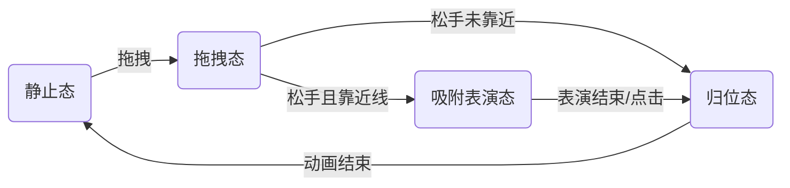

# Vision 驱动的智能悬浮交互 (Smart Floating Interaction)

本文档总结了利用 Apple Vision 框架实现“悬浮小猫智能吸附”功能的完整技术思路、性能优化策略及交互最佳实践。

## 1. 核心设计理念

传统的 UI 吸附通常依赖硬编码的坐标系或特定的 UI 结构。本项目采用了一种**解耦**的方案：**基于视觉识别的动态吸附**。

*   **感知层 (Vision)**：实时“看”屏幕，识别潜在的横纵线条作为吸附点。
*   **交互层 (SwiftUI)**：全屏覆盖层处理手势，将物理拖拽映射为逻辑状态。
*   **表现层 (Animation)**：根据吸附状态（横/纵）动态调整小猫的姿态（旋转/播放视频），并实现平滑的归位动画。

## 2. 技术架构与实现

### 2.1 视觉识别中枢 (`VisionManager`)

为了在移动端实现低功耗、高性能的实时识别，我们采用了多级优化策略：

*   **Core Image 预处理链**：
    *   **灰度化 (Grayscale)**：去除色彩干扰，专注于明暗变化。
    *   **高对比度 (Contrast Boost)**：将对比度拉高至 2.0，使微弱的 UI 分割线变得清晰可辨，极大提高了识别率。
*   **性能优化**：
    *   **降采样 (Downsampling)**：将截图分辨率降低至 **0.5x**。这减少了 75% 的像素处理量，显著降低发热和内存占用，且不影响线条识别精度。
    *   **ROI (Region of Interest)**：仅识别手指周围 **400x400** 区域，避免全屏扫描的算力浪费。
    *   **CIContext 复用**：避免每帧重建 GPU 上下文。
*   **智能过滤算法**：
    *   **长宽比过滤 (Aspect Ratio)**：严格限制横线 (`ratio < 0.1`) 和竖线 (`ratio < 0.2`) 的厚度，剔除按钮、文本块等“伪线条”。
    *   **差异化阈值**：针对屏幕宽高比差异，分别为横线（15% 屏宽）和竖线（4% 屏高）设定不同的长度阈值，有效去噪。

### 2.2 交互状态机 (`PetInteractionManager`)

将复杂的交互逻辑拆解为清晰的状态流转：

*   **Snapping 状态**：区分 `isHorizontalSnap`，决定小猫是“趴在横线上”（旋转 90°）还是“挂在竖线上”（旋转 0°）。
*   **Returning 状态**：实现从任意位置、任意姿态平滑过渡回底部导航栏的静止态。

### 2.3 视图与动画 (`PetOverlayView`)

*   **统一手势处理**：
    *   摒弃独立的 `TapGesture`，在 `DragGesture` 中通过位移阈值（10pt）和时间阈值（0.3s）智能区分“点击”与“拖拽”，解决手势冲突。
*   **吸附位置计算**：
    *   **横线**：小猫中心位于线下方半个身位，模拟“被拎着”或“挂住”的视觉效果。
    *   **竖线**：智能判断左右侧，吸附在边缘外侧。
*   **渐变归位**：
    *   利用 `opacity` 和 `rotationEffect` 的组合动画，在归位飞行过程中，让“拎着的猫”逐渐消失，“趴着的猫”逐渐浮现，实现无缝形态切换。

## 3. 最佳实践总结

1.  **Vision 在 UI 交互中的应用**：
    *   不要直接处理原始截图。**预处理（灰度+对比度）**是提高识别率的关键。
    *   **ROI + 降采样** 是解决实时识别发热问题的黄金组合。

2.  **SwiftUI 手势高级技巧**：
    *   不要混合使用 `Tap` 和 `Drag` 手势，容易导致判定延迟或冲突。
    *   在 `onChanged` 中自行计算位移差 (`translation`) 来判定意图是最可靠的方案。

3.  **动画细节**：
    *   为不同的状态切换配置不同的动画曲线（如拖拽用 `spring`，归位用 `easeInOut`）。
    *   形态切换（如图片 A 变图片 B）最好配合透明度渐变，而不是突变。

## 4. 调试工具

项目中内置了可视化调试开关。在 `PetOverlayView.swift` 中设置 `showDebugVisuals = true` 即可开启：
*   **绿色框**：当前的 Vision 识别区域 (ROI)。
*   **红色框**：识别到的横线。
*   **蓝色框**：识别到的竖线。
*   **数值标签**：实时显示识别到的线条坐标与尺寸。
