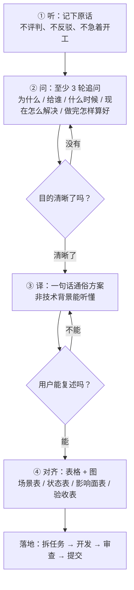
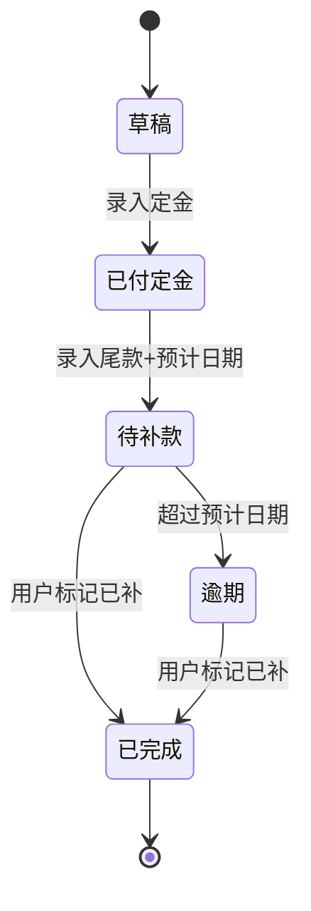
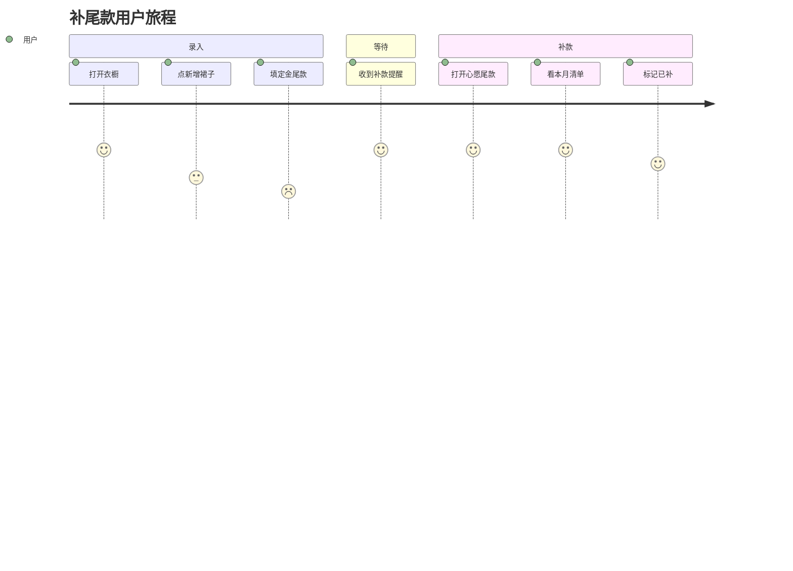
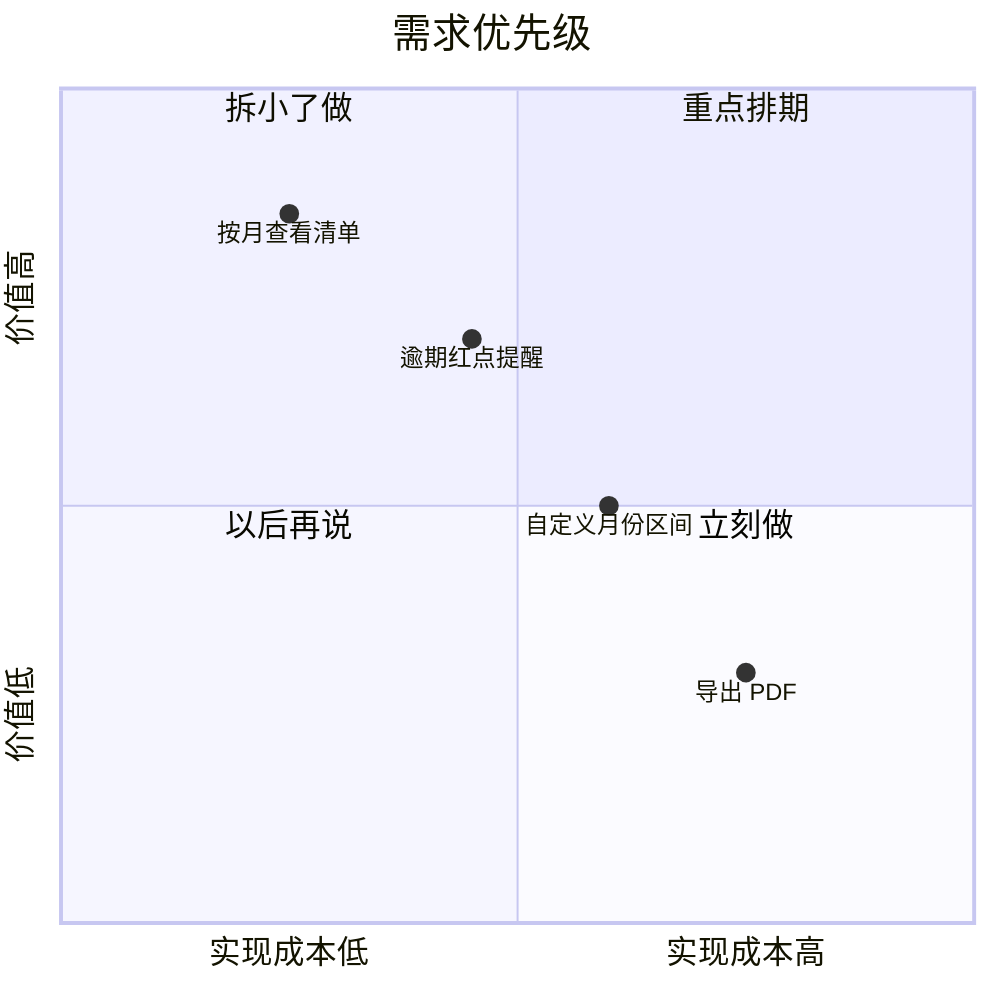

# 业务拆解方法 —— 给只会描述功能的初级 PM / 需求同学

> **这份文档的使用方式**：你只要会说「我想要一个 XX 功能」就够了。
> 剩下的追问、翻译、拆解，由 Agent 带着你做完。
> 产出只有一个硬性标准：**一句话，让你妈/你闺蜜（非技术背景）听完就知道你要做什么、为什么要做。**

---

## 零、为什么会做歪：四种典型翻车

| 翻车形态 | PM 的原话 | 真实目的（没说出口的） | 直接照做的后果 |
| :-- | :-- | :-- | :-- |
| **把方案当需求** | "我要在详情页加一个导出 PDF 按钮" | 她想把裙子清单发给闺蜜看 | 做了 PDF，闺蜜打不开、看不清图，白做 |
| **把指标当目的** | "我要把录入字段减少一半" | 用户录一条裙子要 3 分钟，录到一半跑了 | 砍了字段，统计没法算，老用户炸了 |
| **把竞品当理由** | "XX App 有宠物打工，我们也要" | 用户第二天不再打开 App | 抄了功能，没人用，维护成本背上 |
| **把情绪当需求** | "这个页面太丑了" | 用户找不到"补尾款"入口，焦虑 | 改了配色，用户照样找不到 |

**结论**：功能描述是**表象**，业务目的是**底层**。拆解的全部工作，就是把表象翻译成底层，再翻译成可落地的动作。

---

## 一、四步法（总流程）



**节奏要求**：

| 阶段 | 产出 | 停不下来的条件 |
| :-- | :-- | :-- |
| ① 听 | 需求原话 + 一句话复述 | PM 说"对，就是这个意思" |
| ② 问 | 追问记录表（≥3 轮） | 能回答"不做这个会怎样"，且答案是具体的损失 |
| ③ 译 | 一句话通俗方案 | 用大白话念出来，PM 能笑着点头 / 能自己复述 |
| ④ 对齐 | 4 张表 + 1 张图 | PM 逐行确认"是"，没有"嗯…大概吧" |

> ⚠️ 任何一步出现「大概吧」「你看着办」，**退回上一步重问**。含糊过关 = 返工。

---

## 二、第 ② 步：追问清单（照着问就行）

### 2.1 五问底牌（必问，缺一不可）

| # | 问题 | 在挖什么 | 追问示例 |
| :-- | :-- | :-- | :-- |
| Q1 | **这是给谁的？** | 用户角色 | "是所有用户，还是买过预售裙的那批？" |
| Q2 | **她什么时候会用到？** | 触发场景 | "是月底对账时，还是刚下单那一刻？" |
| Q3 | **她现在怎么解决的？** | 现状痛点 | "现在翻微信聊天记录？还是记备忘录？" |
| Q4 | **不做的损失是什么？** | 真实价值 | "漏掉补款会怎样？会被砍单吗？" |
| Q5 | **做完怎样算好？** | 可衡量结果 | "是'能看见'就算好，还是要'漏单数下降'？" |

### 2.2 五层「为什么」（挖到目的为止）

```text
PM：我要一个按月筛选的功能。
→ 为什么？      因为裙子太多，找不到。
→ 为什么找不到？ 因为想看这个月要补尾款的有哪些。
→ 为什么要看？  因为怕漏掉补款 deadline。
→ 漏了会怎样？  定金打水漂，还会被卖家拉黑。
→ 所以真实目的是？ → 让用户不漏掉补款、不损失定金。
```

**停下来**：当答案变成「会损失钱 / 会流失用户 / 会被投诉」这类**具体代价**时，就挖到底了。

### 2.3 反问场景（PM 给的其实是方案时）

| PM 说 | 你要反问 |
| :-- | :-- |
| "加一个按钮" | "如果不加按钮，你想让用户做成什么事？" |
| "照 XX App 做" | "我们用户和她们用户一样吗？我们现在缺的是这一步吗？" |
| "领导要求做" | "领导想解决什么问题？做砸了他会怎么看？" |
| "先做了再说" | "做出来没人用，我们怎么判断它失败了？" |
| "越多越好" | "如果只能留一个功能，你留哪个？" |

---

## 三、第 ③ 步：一句话通俗方案

### 3.1 模板（填空即可）

> **谁**（角色）在 **什么场景** 下，因为 **什么问题**，现在要 **做什么**，做完后 **能达到什么可衡量的结果**。

### 3.2 好 vs 坏（对照表）

| 坏例子 | 为什么坏 | 好例子 |
| :-- | :-- | :-- |
| "新增尾款管理模块，支持按月聚合查询" | 全是技术词，非技术听不懂 | "买了预售裙的姑娘，月底打开 App 就能看到这个月要补哪些尾款、一共多少钱，不用再翻聊天记录，也不会漏掉补款被砍单。" |
| "优化衣橱列表性能" | 没说给谁带来什么 | "裙子攒到几百条的老用户，滑列表不再卡顿，找一条裙子不用等加载。" |
| "新增 AI 穿搭推荐" | 目的不明 | "不知道明天穿什么的新人，点一下就有三套能直接穿出门的搭配，不用再自己瞎搭。" |

### 3.3 自检五问（全部答"是"才过关）

| # | 自检 | 不通过的典型 |
| :-- | :-- | :-- |
| 1 | 句中没有任何技术名词？（PDF、接口、缓存、聚合…） | "做一个缓存层" |
| 2 | 说清了**人**和**场景**？ | "提升用户体验" |
| 3 | 说清了**现在的痛**？ | 只描述未来，不说现在多惨 |
| 4 | 结果**可衡量**？（能数出来 / 能对比） | "让用户更爽" |
| 5 | 念给你妈听，她能复述大意？ | 她问"所以到底是干嘛的" |

---

## 四、第 ④ 步：用表格 + 图对齐（这是最容易省、也最容易出事的一步）

### 4.1 四张必填表

#### 表 A：场景-动作-结果（把一句话拆成可验证的行为）

| 角色 | 场景 | 触发点 | 用户动作 | 期望结果 | 失败信号 |
| :-- | :-- | :-- | :-- | :-- | :-- |
| 买了预售裙的用户 | 月底对账 | 打开「心愿尾款」 | 选择月份 | 看到该月待补清单 + 总额 | 清单为空但用户明明有尾款 |
| 同上 | 补完款后 | 点「已补款」 | 勾选 | 总额减少、条目变灰 | 金额没变 |

#### 表 B：状态流转（有哪些状态、谁能改）

| 当前状态 | 事件 | 下一状态 | 触发者 | 备注 |
| :-- | :-- | :-- | :-- | :-- |
| 已付定金 | 录入尾款金额 | 待补款 | 用户 | 必填预计补款日期 |
| 待补款 | 用户标记已补 | 已完成 | 用户 | 总额实时重算 |
| 待补款 | 超过预计日期 | 逾期 | 系统 | 首页红点提醒 |

#### 表 C：影响面（改动会碰到谁）

| 影响对象 | 具体影响 | 是否要改 | 风险 |
| :-- | :-- | :-- | :-- |
| 数据模型 `Clothing` | 新增 `expectedBalanceDate` | 是 | 需写 SwiftData 迁移 |
| 首页 | 新增逾期红点 | 是 | 不能影响默认皮肤 |
| 备份 `BackupService` | 导出字段增加 | 是 | 老备份要能导入 |
| 多语言 | 新增 3 条文案 | 是 | 9 种语言都要补 |
| 主题皮肤 | 无关 | 否 | — |

#### 表 D：验收标准（做完怎么算好）

| # | 验收点 | 判定方式 | 通过标准 |
| :-- | :-- | :-- | :-- |
| 1 | 按月查看 | 手造 3 条不同月份数据 | 只显示该月条目 |
| 2 | 总额正确 | 定金+尾款=总价 | 数值与手算一致 |
| 3 | 空态 | 该月无数据 | 显示"本月没有要补的尾款" |
| 4 | 老数据兼容 | 升级后打开 | 老条目不崩、不丢 |
| 5 | 多语言 | 切英文 | 无中文漏出 |

### 4.2 一张图：状态机 / 流程 / 优先级，选一个画

**① 状态流转图**（有状态的功能必画）



**② 用户旅程图**（跨多个页面的功能画这个）



**③ 优先级四象限**（做不完时砍需求用）



> 画图原则：**一图只说一件事**。图的作用是让 PM 一眼指出"这里不对"，比看十行字有效。

---

## 五、完整实战案例

### 5.1 原始需求

> PM：「我想在尾款页面加一个按月筛选，然后能导出成表格。」

### 5.2 追问（节选）

| 轮次 | 问 | 答 |
| :-- | :-- | :-- |
| 1 | 这是给谁的？ | 买预售裙的，手上同时有五六条裙子在等补款的人 |
| 2 | 什么时候用？ | 快到月底，或者卖家发补款通知的时候 |
| 3 | 现在怎么解决？ | 翻微信聊天记录、翻备忘录，经常漏 |
| 4 | 漏了会怎样？ | 定金打水漂，严重的被卖家拉黑 |
| 5 | 导出表格是要干嘛？ | 想发给闺蜜帮她一起记……（追问：其实更想自己心里有数） |
| 6 | 做完怎样算好？ | 打开就能看见这个月要补多少，不用翻别的地方 |

**关键发现**：「导出表格」是伪需求（自己都说了"其实更想心里有数"），「按月」也只是她以为的解法，真正要的是**"打开就有数、不漏"**。

### 5.3 一句话方案

> 手上压着好几条预售裙的姑娘，快到补款的时候，打开 App 就能一眼看到**这个月要补哪些、一共多少钱、哪条快到期了**，不用再翻聊天记录，也不会因为漏补损失定金。

### 5.4 拆解结论

| 项 | 结论 |
| :-- | :-- |
| 做 | 按月清单、本月总额、即将到期置顶、逾期标记 |
| 不做（本期） | 导出 PDF（伪需求）、自定义日期区间（低频） |
| 数据变更 | `Clothing` 新增 `expectedBalanceDate`，需迁移 |
| 影响面 | 首页红点、备份字段、10 语言文案 |
| 验收 | 见表 D |

---

## 六、需求拆解单（模板，直接复制）

```markdown
## 需求：____

### 1. 原始需求（PM 原话）
> 

### 2. 追问记录
| 轮次 | 问题 | 回答 |
| -- | -- | -- |
| 1 |  |  |

### 3. 一句话方案（非技术背景能听懂）
> 谁 / 什么场景 / 什么问题 / 做什么 / 什么可衡量结果

### 4. 自检五问
- [ ] 无技术名词 - [ ] 有人和场景 - [ ] 有现在的痛 - [ ] 结果可衡量 - [ ] 念给外行能复述

### 5. 场景-动作-结果表
| 角色 | 场景 | 触发点 | 动作 | 期望结果 | 失败信号 |
| -- | -- | -- | -- | -- | -- |

### 6. 状态流转（含图）
| 当前状态 | 事件 | 下一状态 | 触发者 |
| -- | -- | -- | -- |

### 7. 影响面
| 影响对象 | 是否要改 | 风险 |
| -- | -- | -- |

### 8. 做 / 不做清单
- 本期做：
- 本期不做（及原因）：

### 9. 验收标准
| # | 验收点 | 判定方式 | 通过标准 |
| -- | -- | -- | -- |

### 10. 图
（状态图 / 旅程图 / 优先级图，至少一张）
```

---

## 七、反模式清单（看到就打回）

| 反模式 | 表现 | 处置 |
| :-- | :-- | :-- |
| 需求里全是技术词 | "做一个缓存层 / 加个接口" | 逼问业务目的，翻译成大白话 |
| 一句话方案自己都念不顺 | 念到一半卡壳 | 重写，直到能一口气念完 |
| 没有"现在怎么解决" | 说不出用户现状 | 补问 Q3，说不出就是需求不成立 |
| 验收标准写"功能正常" | 不可判定 | 改成"手造 X 数据 → 看到 Y" |
| 影响面只写"前端" | 漏了迁移/备份/多语言 | 对照表 C 逐项过 |
| 一次塞 10 个功能点 | 拆解单超一页 | 砍到本期只做 1 个核心闭环 |
| 图和数据对不上 | 状态图有"已取消"，表里没有 | 以表为准，改图 |

---

## 八、与开发流程的衔接

拆解单确认后，进入 `Agent.md` 第 2.1 节的七步流程：

```text
拆解单（本文档） → 定位落点 → 写方案 → 编码 → 自验 → 子代理审查 → git commit
```

**拆解单是验收的基准**：阶段审查的 R1「代码是否满足需求」，逐条对照的就是表 A 和表 D。
没有拆解单，审查无从谈起。
