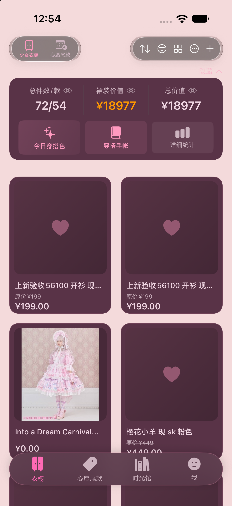
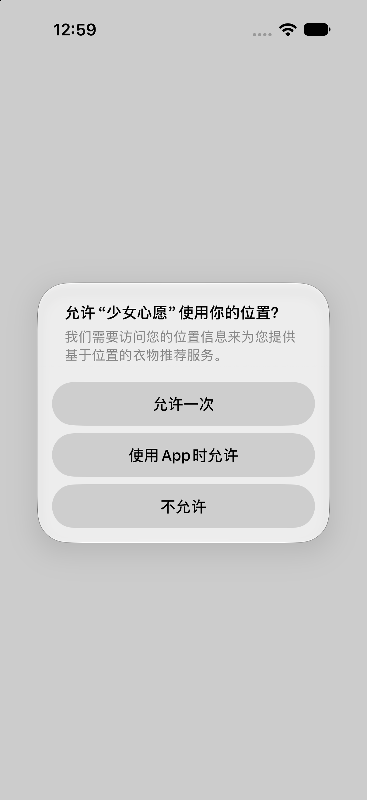
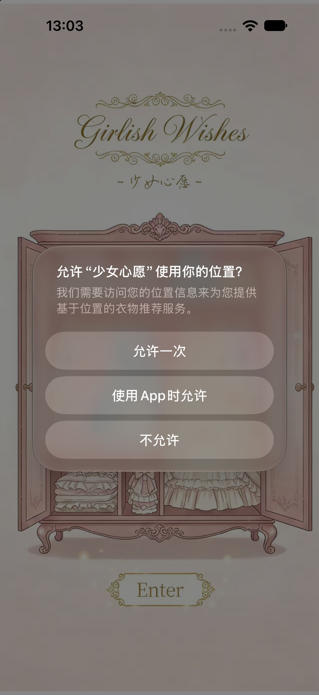

# 启动问题排查：无法启动 + 强制横屏（2026-09-23）

针对反馈「App 无法启动，且进入后自动切横屏、无法保持竖屏」的排查记录与处置。

---

## 一、最近做过的改动（供对照）

| 需求 | 内容 | 主要新增/修改文件 |
| --- | --- | --- |
| G | **尺码表按款式（SPU）共享**：同款不同色共用一份尺码表，不再按颜色各存一份 | `ShopCatalogSizeChartSharing.swift`(新)、`ShopCatalogStore.swift`、`ShopCatalogOps.swift`、商品详情/点菜页/深度编辑页 |
| H | **SPU/SKU 分层重构**：尺码表/面料/款式描述归款式、只录一次；配色图/颜色/尺码选择归颜色 | `CatalogStyleProfile`(模型)、`ShopCatalogStyleProfileSharing.swift`(新)、`ShopCatalogStyleEntryView.swift`(新，两步式录入表单)、`ShopCatalogOpsManageView.swift` |

判定：**这两轮改动都不在启动路径上**（都是商品目录的读写与视图层，走 JSON 懒加载），与本轮的启动/方向问题无关。

---

## 二、强制横屏 —— 已定位并修复

### 根因
`ItemManager.xcodeproj/project.pbxproj` 中：

- `INFOPLIST_KEY_UISupportedInterfaceOrientations_iPhone` 被**整条删除**；
- `INFOPLIST_KEY_UISupportedInterfaceOrientations` 被改成只剩横屏：
  `"UIInterfaceOrientationLandscapeLeft UIInterfaceOrientationLandscapeRight"`。

于是编译出的 `Info.plist` 里 `UISupportedInterfaceOrientations~iphone` **没有 Portrait**，系统只能横屏。

> 该改动**不是本轮 Agent 所为**（pbxproj mtime 11:44，晚于当轮 11:18 的最后一次构建）。
> 另外 `AppDelegate.orientationLock` 默认 `.all`，**它不决定这个**，排查时不要往那里找。

### 修复
恢复 `_iPhone = Portrait + LandscapeLeft + LandscapeRight`，`_iPad` 顺序还原为原始值。
修复后 `project.pbxproj` 除 `MARKETING_VERSION 3.8 → 4.0` 外与提交版本一致（版本号也不是本轮改动）。

### 验证
```
plutil -p <ItemManager.app>/Info.plist | grep -A4 iphone
  "UISupportedInterfaceOrientations~iphone" => [
    0 => "UIInterfaceOrientationPortrait"
    1 => "UIInterfaceOrientationLandscapeLeft"
    2 => "UIInterfaceOrientationLandscapeRight"
```
启动后截图 `pixelWidth 1206 × pixelHeight 2622` = 竖屏。



---

## 三、「无法启动」—— 复现不到启动崩溃，真身是「深色模式启动图纯黑 + 冷启动慢」

### 1. 崩溃报告：没有一份是启动崩溃
`~/Library/Logs/DiagnosticReports/ItemManager-*.ips` 共 40 份，**每一份的调用栈里都有 `XCTest`**，
另有 `ItemManagerTests`、Core Data。原因是**单测宿主就是主 App**（`procName` 同样是 `ItemManager`），
所以这些是测试进程崩溃，**不是 App 启动崩溃**。

### 2. 实测启动耗时与现象（Debug 构建 / 模拟器 iPhone 18 Pro）
| 场景 | 到首帧耗时 | 期间画面 |
| --- | --- | --- |
| 热启动 | 约 3–4 s | 主要也是黑 |
| 冷启动（卸载重装） | 约 9–26 s | **纯黑** |

启动节奏（`LaunchFlow` 日志）：
```
launch_start                         ← 进程 spawn 后约 1.8 s
splash_finish trigger=auto_timeout   ← 约 4 s
launch_critical_init_finish duration_ms=3637
```

### 3. 黑的来源
`INFOPLIST_KEY_UILaunchScreen_Generation = YES` 会生成一个**空的** `UILaunchScreen` 字典，
系统按默认背景铺满 —— **深色模式下就是纯黑**。同一时刻切换 light 模式截图是浅色背景，反证成立：

- 深色模式同期：纯黑
- 浅色模式同期：浅色



### 4. 处置
1. `INFOPLIST_KEY_UILaunchScreen_Generation[sdk=iphoneos*|iphonesimulator*]` 改为 `NO`；
2. `ItemManager/Info.plist` 显式声明启动图：
   ```xml
   <key>UILaunchScreen</key>
   <dict>
       <key>UIImageName</key><string>LaunchSplash</string>
       <key>UIImageRespectsSafeAreaInsets</key><false/>
   </dict>
   ```
3. 新建 `Assets.xcassets/LaunchSplash.imageset`，**图片放在 3x 槽位**。

> 两个坑：
> - 图片放 **1x** 会让系统启动图放大约 3 倍，只露出画面中间一条（第一版这么写的，截图已确认）；
> - 不能直接复用 `SplashScreen.imageset`，因为 `BuiltinImagePicker` 也按名字引用它，改其 scale 会波及那边。



### 5. 尚未处理的优化项（本轮的真正瓶颈，未改动）
首帧阻塞点在

```swift
// ItemManager/ItemManagerApp.swift
.modelContainer(SharedPersistence.shared.sharedModelContainer)
```

`SharedContainer.shared` → `SwiftDataMigrationManager.shared.createModelContainer()` 在主线程执行完毕之前，
SwiftUI 不会渲染第一帧，窗口只剩背景色。把它拆成「先渲染轻量根视图、容器就绪后再挂载」，
才能实质缩短冷启动黑屏。这属于持久层启动流程改造，**本轮未动**，需要你确认后再做。

---

## 四、其他

- `ItemManager.xcodeproj/-Xcc` 是一份 21 MB 的 clang module 缓存（pbxproj 未引用，构建时误落在工程包内），
  已移到 `/tmp/pinkhouse_junk_backup/-Xcc`。
- `MARKETING_VERSION 3.8 → 4.0`（pbxproj 两处）不是本轮改动，未作处理。

---

## 五、如果真机上仍然无法启动

当前环境（模拟器 + 本轮代码）**无法复现**启动失败，需要补充：

1. 是真机还是模拟器？系统版本、机型；
2. 具体表现是「**闪退**」还是「**长时间黑屏后仍能进入**」；
3. 真机的崩溃日志：Xcode → Window → Devices and Simulators → 选中设备 → View Device Logs，
   找 `ItemManager` 的 **crash** 报告（注意区分 `-Runner` / 测试进程）。
