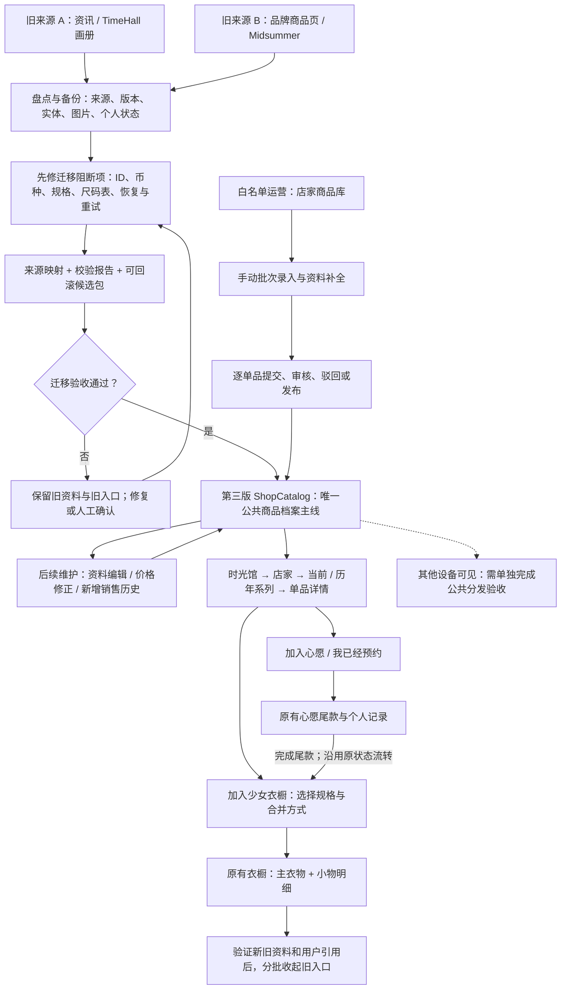
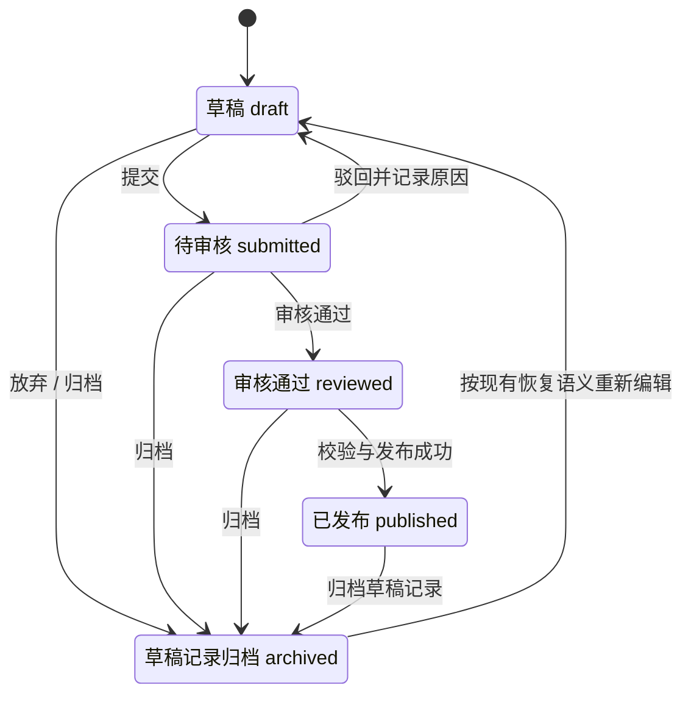
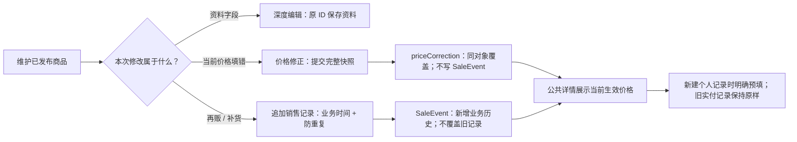
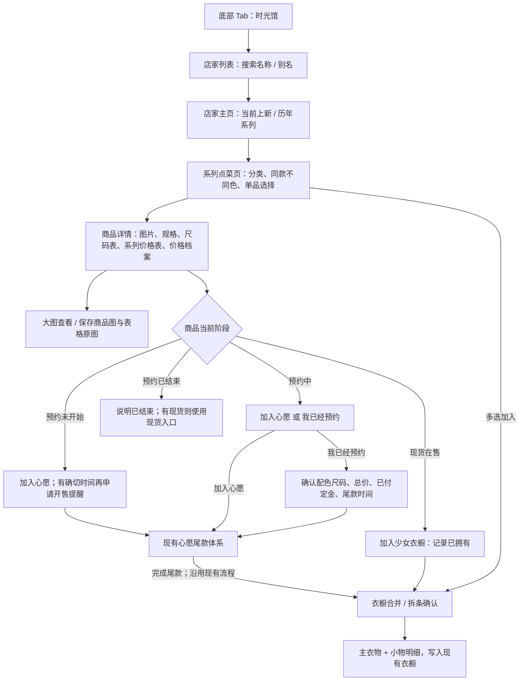

# 时光馆上新：第三版收口迁移、业务流程与 Agent 执行审查方案

> 仓库：`dragon717/Pink_House`  
> 核查基准：`main @ a4bc894d889d2bc187bc7b221147e59c62bbba7e`  
> 基准提交时间：`2026-09-22T15:16:46Z`（UTC）；提交主题：系列列表排序下沉到 Service。  
> 文档状态：**仓库静态核查后的执行方案；本次未修改或提交仓库代码，未运行项目的 Xcode 构建、Swift 单测、UI 测试或真实设备迁移。**  
> 本文的“第三版 / V3”是本次收口目标的工作名称，指 **当前 ShopCatalog 实现**，不是宣称仓库存在名为 V3 的正式 tag、分支或统一版本号。

## 0. 本次要做什么

**以当前 ShopCatalog 为唯一继续开发的上新主线，将前两代中仍有效的资料、能力和未完成迁移工作接入这条主线；不把旧页面、旧发布入口和已撤销的需求一并复活，也不再新建第四套上新系统。**

本次工作的三个交付面：

| 交付面 | 最终状态 |
|---|---|
| 产品流程 | 时光馆 → 店家 → 当前 / 历年系列 → 点菜单品 / 商品详情 → 现有心愿、心愿尾款、少女衣橱；运营统一在“店家商品库”维护 |
| 数据迁移 | 旧 TimeHall、Midsummer，以及确实存在的旧运营资料，经稳定 ID 映射、字段补齐、校验后进入 ShopCatalog；已有个人记录不重建、不覆盖 |
| 工程收口 | 新写入只走 ShopCatalog；旧馆暂留可回滚入口，满足数据与用户状态验收后再分批下线；旧分发基础设施、公共落库工具按依赖保留 |

### 0.1 核查边界

本次读取了现行需求与重构文档、时光馆壳层、Catalog 模型与价格派生、运营草稿与发布服务、运营入口、商品详情、衣橱联动、旧收藏迁移器、Python 迁移工具和 Midsummer 源数据样本。[S01][S02][S03][S04][S05][S06][S07][S08][S09][S10][S11][S12]

**不把文档里的“已通过”当成本次运行结果。** 旧重构文档记录过“10 店家 / 40 系列 / 109 商品”和若干测试通过数，这些是当时的实施记录，不是本次重新统计的当前覆盖率；当前数量、云端存量、真机效果由执行 Agent 实测并生成报告。[S02]

本次另外执行了一个独立 Foundation 最小实验，验证“ISO8601 编码日期 + 默认 JSONDecoder”会读取失败，匹配 ISO8601 解码策略后成功。它仅支撑 §3 的日期编解码风险判断，**不等于运行了本项目测试**。

---

## 1. 先把“几版上新”归一化

仓库里同时存在产品方案版本、历史页面实现和数据管道，不能简单按文件名里出现的 V1 / V2 / V3 排序。按本次迁移任务，采用以下工作分组：

| 工作分组 | 仓库里的实际载体 | 迁入第三版的内容 | 不原样带入的内容 |
|---|---|---|---|
| 旧来源 A：资讯 / 编年史型时光馆 | `品牌上新资讯_开发规格.md`、旧 TimeHall 画册与资讯资料、静态 / CloudKit 分发方案 | 有证据的店家、系列、商品图、价格、日期、来源记录；已经可用的分发校验、缓存与撤回能力按适配需要复用 | 购买链接、物流 / 出货流程、四模式作为默认首页、把资讯当成商品实体的设计 |
| 旧来源 B：品牌商品页强化型 | `TIME_HALL_REBUILD_AND_COMMERCE_PLAN.md`、TimeHall Commerce、Midsummer 独立品牌页与规格数据 | 颜色尺码、真实 SKU、价格分档、定金尾款、结构化尺码表及原图、主衣物与小物联动能力 | 独立品牌录入 / 发布闭环、第二套商品身份、将一个系列无条件合成一个商品、继续扩建 Rebuild 首页 |
| 第三版目标：当前 ShopCatalog | `ItemManager/Models/ShopCatalog/`、`Services/ShopCatalog/`、`Views/ShopCatalog/` | 作为唯一目标模型、查询层、运营入口和个人数据联动层 | 不回退到旧文档已过时的入口、表单和价格语义 |

上述是迁移来源的分组，不是对完整 Git 历史做出的“三个正式发行版本”结论。`少女心愿_店家上新_第一版落地计划.原版备份.md` 等备份是文档历史，不应被 Agent 当成另一套需要重新实现的产品。[S03][S13][S14][S15]

### 1.1 生效规则的优先顺序

1. 本次用户目标与明确产品边界：第三版为基准，不改变现有 App UI，不做购买 / 支付 / 订单 / 物流。
2. 本文明确列出的收口决策；实施时与最新 HEAD 对照，新增决策不得偷偷替换。
3. 当前代码已实现且不属于缺陷的最新行为，特别是 2026-09-22 的改动。
4. 旧需求文档只补充仍有效的业务意图，不覆盖较新的实现决策。

**代码不是天然正确。** 保留新规则与修复新代码缺陷是两件事：例如保留手动批次录入，但修复草稿重启恢复失败；保留追加销售历史，但修复重复发布造成重复事件。

### 1.2 必须消除的文档漂移

| 旧说法 / 易误读点 | 第三版有效口径 |
|---|---|
| 淘宝分享文本 / 多链接解析是上新必经路径 | **已下线。** 当前 UI 只保留手动连续录入；旧草稿可兼容读取，不恢复 Parser、粘贴入口或自动解析发布。[S06][S07] |
| 预约 / 现货二选一表单 | 新草稿允许预约价、现货价并存；兼容旧 `saleKind == .stock` 且未填写 `stockPrice` 的草稿，不能把旧现货价再解释成预约价。[S06] |
| 尺码表和价格表是一张混合表 | 商品的 `CatalogSizeChart` 与系列的 `CatalogPriceChart` 分开；系列价格表不复制成每个商品一份。[S05] |
| 第一版“不做 OCR”可永久禁止后续能力 | 较新模型已明确价格表 OCR / 人工修正意图。不要按旧文档移除现有识别入口；实际识别、失败降级与保存回显需单独验收，不能仅凭模型注释认定全部可用。[S05][S15] |
| 所有价格修改都要新增 SaleEvent | 更正当前价格走 `correctCurrentPrice`；新增再贩 / 补货记录走 `appendSaleRecord`；新商品初次发布仍由草稿发布入口建立初始销售记录。[S06] |
| 修正快照里的 nil 一律回退到历史价格 | 当前实现中：有修正对象时，字段 nil 表示清除该价格，展示“暂无”；只有整个 `priceCorrection == nil` 才回退历史。模型早期注释需要同步修正。[S05][S06] |
| “加入心愿”意味着 `isDepositPlan = false` | 当前心愿复用心愿尾款口径，`PriceMode.wishlist` 写 `isDepositPlan = true`、定金 0；不能误迁为“已拥有”。[S09][S10] |
| 同款不同色展示合并 = 合并商品 ID | `designName` 是展示归组线索；保持 Product / Variant 的稳定身份，不自动改写已被用户引用的 ID。[S05][S08] |
| 旧 Phase 0–3 已完成 = 可以删除全部旧代码 | 不成立。壳层和收藏迁移已经存在，但迁移完整性、重试、云端存量与旧工具依赖仍需验收。[S02][S04][S09][S10] |

---

## 2. 当前已实现与本轮待做边界

| 能力 | 本次核查结论 | 本轮动作 |
|---|---|---|
| 时光馆首屏为 ShopCatalog | **代码确认**：`TimeHallView` 直接挂载 `ShopCatalogBrowseView` | 保留，不重做入口 |
| 旧馆过渡入口 | **代码确认**：仍可进入 `TimeHallLegacyArchiveView` | 保留回滚；“只读”须检查实际交互，而非仅凭注释认定 |
| 旧收藏运行时迁移 | **代码确认**：壳层 `.task` 调用迁移器 | 修复失败重试 / 资源就绪门槛，不能另写第二套同功能迁移 |
| 运营手动批次、连续添加单品 | **代码确认** | 保留手动批量能力；删除的是淘宝批量解析，不是手动批量录入 |
| 提交、审核、驳回、发布 | **服务代码确认**：只允许 reviewed 草稿发布；驳回保留原因 | 补重启恢复、持久化错误、重复点击和半成功重试测试 |
| 预约价、现货价并存 | **代码确认** | 保留旧草稿兼容，不恢复互斥表单 |
| 当前价格修正 / 历史追加 | **代码确认**：独立接口和存储语义 | 保持分离；核对详情与新增个人记录使用一致的价格口径 |
| 同 ID 覆盖层替换 | **代码确认**：普通实体同 ID 替换；销售事件数组追加 | 防止新基底与旧覆盖层的事件重复；实体删除语义另行验收 |
| 系列价格表、商品尺码表、规格图绑定 | **模型 / 部分页面代码确认** | 做源字段迁移、原图保全和上传→保存→回显验收 |
| 同款不同色 | **模型、发布与商品详情代码确认** | 只做展示归组，保留实体及用户引用 |
| 主衣物 + 小物联动 | **代码确认**：复用既有 Draft / Inserter 管线 | 不重写衣橱；必须回归多件合并及多主衣物拆条 |
| Python 旧资料迁移工具 | **代码确认存在**，但见 §3 阻断项 | 修改现有工具后重跑，不能把“脚本存在”当成“迁移完成” |
| 公共分发到其他设备 | **本次未验证闭环** | 已核查的 publish 是本地覆盖层链路；其他设备可见必须另做分发验收 |

依据：[S04][S05][S06][S07][S08][S09][S10][S11]。

---

## 3. 先修再迁：本轮发现的关键问题

这里的“P0”是**扩大迁移 / 下线旧入口之前的阻断项**，不是声称每条都已在真实用户设备上复现。

| 编号 | 优先级 | 证据与风险 | 修改要求 / 最小验收 |
|---|---|---|---|
| R01 | P0 | `persist()` 用 ISO8601 编码草稿；`loadDrafts()` 直接用默认 `JSONDecoder()`，失败后通过 `?? []` 当成空草稿箱。存在重启后草稿不可见及后续覆盖旧文件风险。[S06] | 草稿编解码统一；兼容确实存在的历史日期格式；解码失败保留原文件、报告错误，不作为空库写回。保存带日期草稿→重启→内容和状态完全一致。 |
| R02 | P0 | 迁移工具把 `priceJPY / salePriceJPY / regularPriceJPY` 直接写入无币种的 `price`；CatalogSaleEvent 当前无币种字段，衣橱草稿又写死 CNY。[S05][S10][S11] | 打通金额与币种。日元不得按人民币入库；不能默认换汇；来源不明标“币种待确认”。跨币种不计算预约 / 现货差价。 |
| R03 | P0 | 画册 item 的 productCode 只要在 commerceItems 中出现便被跳过，但 `scope=catalogue` 随后又跳过整个 commerceItems。[S11] | 默认模式仍须保留画册成员；去重条件必须考虑本次实际迁入范围。构造同码 item + commerce fixture：catalogue 模式不能两边都丢。 |
| R04 | P0 | `unique_id()` 对已存在 ID 自动加 `-2/-3`；variant、event 用顺序号；合成系列使用当前年份 / 顺序号。重新执行或扩大范围可能生成重复实体、ID 漂移或跨快照冲突。[S11] | 持久化来源→目标映射；同来源重放是 no-op 或明确更新，不是改 ID 再新增。catalogue→full 保持公共部分的身份不变。 |
| R05 | P0 | 文档承诺迁移 `priceTiers` 和 `sizeChart`，但已读完整迁移逻辑没有将 TimeHall 的这些字段生成目标记录；目标 `sizeCharts` 初始化后未获得实际迁入内容。[S02][S11] | 按真实源模型实现价格分档、定金尾款、结构化尺码表与原图映射；不能只迁一个现货标量就宣称完整。 |
| R06 | P0 | Midsummer 源样本有 `specGroups` 与 `skus[].options`（例如 style=op / jsk），脚本却主要取顶层颜色尺码及 sku.color / sku.size，并把商品分类写为“其他”。[S11][S12] | 解释 options → specGroups，保留真实 SKU 组合；系列下 OP / JSK 是不同商品语义，不可只剩“其他 + 尺码”。不对不存在的组合做笛卡尔积补造。 |
| R07 | P0 | 未知价格被脚本写成 `0` 的 SaleEvent；还可能因定金缺失把含糊记录判为现货，抓取日期被当作业务日期。[S11][S12] | 未知 ≠ 免费；价格缺失允许资料待补，但不伪造 0 元销售事件。业务阶段、销售日期、抓取日期分开；证据不足不推断为正在售卖。 |
| R08 | P0 | 收藏迁移器无论本轮有多少 unmatched / 单条异常，完成后都会写全局标记；后续自动入口见标记即跳过。[S09] | 区分“本轮执行过”与“全部迁移完成”；保存逐条结果和失败原因，已成功不重复，资源补齐后只重试未完成项。保留原 treasured 键。 |
| R09 | P0 | publish 校验传入草稿快照后生成随机事件 ID；覆盖层先落盘，草稿状态后写回且 persist 吞错。重复旧 reviewed 快照 / 半成功重试可能再次追加。[S06] | 以持久化 draftID / 操作键防重复；记录发布结果与目标 ID。覆盖层写成、状态写失败后可恢复；不能重新生成一组事件。 |
| R10 | P0（扩大跨端分发前） | 当前核到 `publish → saveOverlay → reloadWithOverlay`，图片存在本地引用设计；本机显示不是其他设备已发布的证据。[S02][S06][S07] | 将“本机发布”和“公共分发成功”分开验收。导出包若含 local: 图片，必须包含可解析资源和重映射，不能只导出 JSON 后宣称全量可用。 |

### 3.1 需要同时审查的 P1 风险

- **资料清除 / 归档语义**：覆盖层删掉一条记录，不等于删除 Bundle 基底的实体。规格、尺码表的“整组替换”和归档父级的查询隐藏必须验收，防止刷新后旧数据重现。[S01][S06]
- **图片引用重映射**：发布时遇 asset ID 冲突会换 ID，必须同步处理 product.images、variant.imageAssetID、尺码表原图及系列封面等全部引用。[S05][S06]
- **价格展示与入库不一致**：`CatalogPriceArchive` 支持修正后的当前值，但预约入库分支直接使用 `archive.reservation.price`。需要确认“新建预约记录”应使用哪个值并统一展示 / 预填；已经存在的个人实付记录不能被公共修正覆盖。[S05][S10]
- **物理删除保护的边界**：本机查不到引用不证明其他设备或其他用户没有引用。正式公共档案优先归档；不要据本机查询就删除全局已发布商品或其资源。
- **草稿归组一致性**：批次和草稿分别落盘，需要补“批次成功、草稿失败”的恢复测试；删除批次只删除归组记录，不得连带删除已发布商品。[S06][S07]

---

## 4. 总流程图：旧来源并入一条上新主线



**这张图描述的是目标闭环，不是宣称所有节点当前均已完成。** 公共资料、用户私有记录、分发渠道是三个边界；不能把运营改公共价格等同于改用户实付记录，也不能把本机 JSON 写入等同于云端发布。

---

## 5. 运营端上新流程：按最新代码口径收口

### 5.1 手机端正式入口

`设置 → 运营工具 → 店家商品库 → ＋补录上新 → 手动录入（可连续添加多件）`

当前 UI 会创建批次会话和首条草稿。批次用于归组与共用店家 / 系列属性，**每个单品仍有独立草稿、独立审核状态**。删除的是淘宝导入能力，而不是这个手动批次流程。[S06][S07]

### 5.2 录入顺序

| 步骤 | 操作 | 必须落下的事实 |
|---|---|---|
| 1 | 选择已有店家，或新建店家 | 稳定 shopID；新建时名称与别名用于查重候选，不直接作为身份 |
| 2 | 选择已有系列，或新建系列 | seriesID、所属店家；年份未知保留未知，不靠当前年份冒充历史年份 |
| 3 | 维护系列资料 | 封面 / 简介、系列级预约价格表；原图保留；结构化内容与原图关联 |
| 4 | 连续添加单品 | 每款独立草稿；商品名、分类、可选 designName、商品图片 |
| 5 | 补规格与尺码表 | 真实配色 / 尺码组合、规格图绑定；商品级尺码表及原图 |
| 6 | 补价格和档期 | 预约价、现货价可并存；定金尾款对账；币种明确；未知资料不编造 |
| 7 | 保存草稿 | 保存失败可见、可重试；退出 / 重启不丢；批次与草稿保持一致 |
| 8 | 提交审核 | 单条或整批提交；条目失败不吞掉其余结果；列出未提交项及原因 |
| 9 | 逐单品审核 | 通过进入 reviewed；驳回回 draft 并保留原因；重新提交清空旧驳回原因 |
| 10 | 发布 | 再做服务层权限、状态、引用与数据校验；稳定结果落盘后更新草稿状态 |
| 11 | 用户端验收 | 同设备确认店家 / 系列可达；冷启动检查；若要全体用户可见，再完成公共分发 |

补充：现有代码允许部分价格留空或以后补录；不要为了通过迁移而写 0 元假价格。对缺价格的商品应清晰呈现“待补价格”，是否允许成为公开资料与是否允许形成有价销售事件分开处理。[S06]

### 5.3 草稿审核状态机



**注意：草稿记录归档不自动等于公开商品下架。** 公共实体的隐藏由 `CatalogShop / CatalogSeries / CatalogProduct.archivedAt` 管理。两种“归档”必须在 UI 文案与服务调用中区分，否则容易出现运营以为商品下架、用户端却仍能看到的情况。[S05][S06]

### 5.4 后续维护的三条写入路径

| 场景 | 应用入口 / 领域操作 | 写哪些数据 | 不能做什么 |
|---|---|---|---|
| 改名称、图片、规格、尺码表 | 资料编辑 / 深度编辑 | 原 ID 的实体及关联素材 | 不更换商品身份；不能误清价格修正；不能改用户已有记录 |
| 原来填错当前价格，现在更正 | `correctCurrentPrice` | `product.priceCorrection` 的完整快照 | 不伪造一次再贩；不改已有 SaleEvent |
| 新一轮再贩、补货、真实销售事件 | `appendSaleRecord` | 追加一条 SaleEvent，带业务日期 / 可选批次名 | 不覆盖旧事件；重复提交不得新增第二条 |

初次发布允许一次建立预约和现货两条初始记录；后续“更正已有资料”不要反复走“新建草稿发布”来绕过价格修正接口。[S06]



**价格修正的三个不同动作：**

- 填数字：修正为该数值。
- 修正对象存在、其中某价格留空：清除此价格，展示“暂无”，不自动回退。
- `clearPriceCorrection`：撤销整个修正对象，重新按历史记录推导。

这里应以 `CatalogPriceArchive` 的实际派生逻辑和现有服务接口为准；同步更正旧注释，避免 Agent 再次把“清空”实现成“回退”。[S05][S06]

### 5.5 本机发布与公共分发不可混写

当前已核查的路径是：

`publish → shop-catalog-override.json → ShopCatalogStore.reloadWithOverlay → 本机看到新内容`

它可以作为本地运营验收闭环，但**不能作为另一个账号 / 另一台设备已收到更新的证据**。[S01][S06]

需要正式公共分发时，在同一 Catalog 之上适配已有发布协议；不要重新开一套商品模型。交付物至少包含版本、校验摘要、实体数据、可解析图片资源、撤回 / 回退信息。先验证完整候选包，再切换可见版本；未登录、离线、下载失败、图片缺失均须有明确降级。

这属于渠道闭环验收，不要求本轮无条件重建云服务。未完成时，运营 UI 与审查报告明确写“本机发布 / 待公共分发”，不能写成“所有用户可见”。

---

## 6. 用户端完整流程

### 6.1 浏览、查询、查看资料



四态策略以当前详情页为基准，不恢复旧文档“所有阶段都展示同一组按钮”的做法。多选页须与详情页使用同一套允许动作判定，不能通过系列页绕过确认，将预约商品直接误记为已拥有。[S08]

“加入少女衣橱”是个人管理动作，不是购买。现货存在也不代表用户已经买到；只有用户主动确认已拥有后才建立相应记录。

### 6.2 心愿、预约、已拥有的区别

| 用户意图 | 第三版映射 | 必须确认 |
|---|---|---|
| 只是想拥有 | `PriceMode.wishlist`，复用现有心愿尾款口径，定金为 0 | 未付款不应显示成“已付定金”；价格未知不等于免费 |
| 已经预约并支付定金 | `PriceMode.reservation(depositPaid:)` | 用户实际已付金额、所选规格、采用的价格与币种、尾款时间是否确实公布 |
| 已经拥有 | `PriceMode.stock` 对应已拥有路径 | 用户确认、商品规格、实际记录价格；不能由公共销售状态自动生成 |
| 尾款完成 | 沿用既有尾款状态流转与入衣橱管线 | 更新 / 转换既有记录，防止同一记录重复建立两次 |

`Clothing` 继续保留名称、品牌、图片与个人价格等必要快照，同时通过 catalog 引用回看公共资料。不要照旧文档“不复制资料”的字面说法删除用户记录需要的快照，也不要让公共更正覆写用户已付金额、个人备注或自选照片。[S10]

### 6.3 多件合并规则

演示案例（仅为测试数据，不是店家真实报价）：同一系列选择 JSK ¥428、KC ¥58、袖套 ¥38，币种均为 CNY。

**确认后应是一条衣橱记录：**主类型 JSK；主衣物价格 ¥428；小物明细为 KC ¥58、袖套 ¥38；合计 ¥524。三件选择仍需保留各自来源，不能只剩一个不可追溯的总价。

当选择 JSK + OP + KC 时，当前管线会为不同主衣物拆条，不能把 OP 当成小物强行塞进 JSK。小物当前可归第一条主衣物，但确认页必须说清归属，防止重复挂载或金额重复计算。[S10]

同款不同色是**系列页 / 详情页的展示归组**；选择了哪一个实际商品和规格，就写回对应来源，不能只存 designName。

---

## 7. 前两版资料向第三版的迁移契约

### 7.1 先盘点四类输入，不只扫描 Bundle

| 输入 | 现有情况与迁移要求 |
|---|---|
| 仓库静态资源 | 现有脚本读取 `Resources/TimeHall/catalog*.json`、品牌元数据和 `Resources/Midsummer/midsummer-series.json`。纳入版本与校验摘要。[S11] |
| 运营设备本地资料 | 草稿、批次、ShopCatalog 覆盖层、本地图；与旧品牌运营缓存分别登记。仅迁确有数据的文件，不猜测数量。 |
| 旧公共云端数据 | 只有取得真实导出 / 读取报告才能计为已迁移。现有 Python 脚本读取 Bundle 不证明 CloudKit 存量已覆盖。 |
| 用户私有状态 | treasured 集合、迁移标记、既有心愿 / 尾款 / 衣橱引用；本机安全迁移，不塞入公共 Catalog 导出包。 |

先生成 `inventory.json`，至少记录每个来源的存在状态、版本、采集方式、实体数量、资源数量和校验摘要。没有访问到的云端数据写“未读取 / 未纳入本轮”，不是写 0。

### 7.2 字段级映射

| 来源字段 / 内容 | 第三版目标 | 迁移规则 |
|---|---|---|
| merchantID / brandID / 品牌元数据 | CatalogShop | 通过来源映射解析，名称与别名只协助人工查重；合并有歧义需确认 |
| catalogue / archiveCatalogue / Midsummer series | CatalogSeries | 保留真实年份、名称、封面、简介；缺年份保留未知 |
| item / commerceItem / Midsummer item | CatalogProduct | 先判断是“实际单品”还是“系列打包容器”；不能一律一条源记录一条商品 |
| productCode / legacy itemID | 已有 Product ID 或新稳定映射 | 已对用户暴露的 `th-*` ID 优先保留；不能为了美化命名重建 |
| OP / JSK 等款式选项 | 不同 CatalogProduct；并维持来源关联 | 不同品类不是普通颜色规格；拆分时旧容器到多个目标的映射需保留 |
| 同款不同色 | designName + 各自商品 / 规格身份 | 归组不删原实体；有明确款式名优先，不靠模糊名称直接合并数据库身份 |
| colors / sizes / specGroups / skus.options | CatalogProductVariant | 保留真实 SKU 组合与原有图；只有来源明确允许组合时才展开笛卡尔积 |
| sku.image / 颜色图 | variant.imageAssetID + CatalogAsset | 每次 ID 变换同步更新全部引用；缺图给明确回退，不错绑他款 |
| priceTiers / reservation / stock / rerelease | CatalogSaleEvent | 保留真实业务事件和金额，追加但可幂等；缺价格不创建 0 元事件 |
| deposit / balance | 对应事件金额及币种 | 已知金额才对账；缺项可按明确规则推导，不能虚构已付款事实 |
| JPY / CNY 金额 | 明确币种的金额语义 | 增补模型兼容方案；展示、差价、合并、衣橱落库都使用同一币种 |
| sizeChart 结构与 sourceImage | 商品 CatalogSizeChart + 原图资源 | 两者可独立缺失；缺原图 / 缺结构化必须报告，不能宣称完整 |
| 系列预约价格表 | CatalogSeries.priceChart | 归属于系列；旧混合“尺码表 / 价格表”原图需分类，不擅自覆盖另一种表 |
| 商品图 / 封面 / gallery | CatalogAsset + 正确实体引用 | 保留真实原图；画册图与商品实拍图区分，来源页面 URL 不当作图片 |
| publishedOn / launchedOn / observedAt | 对应业务日期或来源采集元数据 | 抓取时间不是开售时间；未知年份 / 阶段保留未知 |
| treasured 收藏 | PriceMode.wishlist 与来源映射报告 | 不改变原 treasured 键；成功项幂等、失败项可重试；不能变为已拥有 |
| 旧衣橱 / 尾款的来源引用 | 现有 Clothing / 小物引用 | 仅对证据充分的记录补链；不按名称猜测，不重建、不改实付金额 |
| Story / Coordinate / Event / History | 旧馆归档或单独内容迁移清单 | 不强行变成 Product；记录“有意不迁入商品库”，不默默丢弃 |
| 购买链接 / 出货状态 | 非用户商品流程 | 来源链接只在需要的运营溯源范围保留；不恢复用户购买、订单、物流入口 |

依据：[S02][S05][S10][S11][S12][S13][S14]。

### 7.3 身份与去重：先补映射，不先换 ID

推荐新增**迁移产物** `migration-map.json`，不是新增第四套业务数据库。每条至少记录：来源命名空间、来源店家 ID、来源实体类型、来源稳定 ID、目标实体类型与 ID、转换规则版本、处理结果。

必须满足：

- 同一来源同一实体重复执行，目标 ID 不变；新增来源记录不导致旧 variant / event ID 重新编号。
- 来源 A 与来源 B 发生同码不自动认作同商品；必须带来源 / 店家上下文。
- 老库已经暴露的目标 ID 继续使用；若已有重复目标，先做引用审计与别名映射，不直接全量重命名。
- 一对多拆分（旧“系列商品”拆 OP、JSK 等）显式记录映射；旧收藏无法确定是哪款时保留待确认，不自行任选一个。
- 重名只是候选匹配。改商品名、店家改名、跨年份同名系列，都不能让去重误吞不同实体。

当前 `-2/-3` 冲突回避可以使单次数组 ID 看起来不重复，但它不是业务幂等策略。必须用“来源身份是否相同”来决定复用、更新、冲突或新增。[S11]

### 7.4 catalogue / full 两个范围的明确语义

| 范围 | 目标 | 必须保证 |
|---|---|---|
| catalogue | 画册 / 年鉴中的资料，适合较小的随包数据 | 与在售记录同码的画册商品仍可达；不因为 full 未执行而丢失 |
| full | 在 catalogue 之上补齐在售资料及完整关联 | 公共部分复用同 ID；补档案、事件、图片和规格，不复制一整套商品 |

是否进入 Bundle 或走云端分发，按**真实产物体积、资源策略与冷启动测试**决定，不把旧文档的某次 30MB 统计当成当前阈值或当前结果。

### 7.5 价格兼容的最低要求

推荐为销售事件及当前修正快照补足币种语义，具体字段实现由 Agent 做最小兼容设计并记录。验收固定为：

`源金额 + 源币种 → Catalog 展示 → 用户选择 → 个人记录金额 + 同币种`

所有旧 JSON 的无币种记录按可验证来源补齐，不能全局默认 CNY。跨币种不直接比较、不直接合计、不隐式换汇；历史不明价展示待确认。已经迁成错误币种的个人记录先列出影响范围，**不要后台静默改账**。

新公共价格修正只影响公共当前展示与新建记录的预填口径；用户先前确认的价格、定金、尾款属于个人事实，不被运营修改自动覆盖。

### 7.6 图片、尺码表、价格表的验收

每一种资源必须走一遍：

`来源文件 / URL → 迁移资源映射 → Catalog 引用 → 本机解析 → 大图查看 → 保存图片`

若涉及公共分发，再加：

`导出或发布 → 无运营本地目录的另一台设备 → 相同图片可见 / 可保存`

本地图 `local:` 不能跨设备凭文件名自然成立；发布包必须提供资源字节或全设备可解析的受控引用。旧画册、商品图、尺码表、系列价格表不互相覆盖；图库资源按所有引用联合判定后才能清理。

### 7.7 收藏迁移与个人数据保护

现有 `TimeHallTreasuredWishMigrator` 继续作为唯一入口，增补以下语义，不新建竞争迁移器：[S09]

| 情况 | 正确行为 |
|---|---|
| Catalog / 旧来源尚未就绪 | 不写“全部完成”标记，等待具备条件再执行 |
| 某条已成功迁入 | 重放跳过，不再建第二条心愿 |
| 某条源商品未迁入 | 保留原收藏与失败原因，后续候选包补齐后可重试 |
| 某条落库失败 | 保留错误，可单条重试；不能永久盖过失败 |
| 用户已删除对应心愿 | 根据迁移日志辨识“迁移后主动删除”，防止重放复活；不能只查未删除记录决定再次新增 |
| 一个旧容器对应多个新商品 | 无法判断用户原意时要求确认；不任意选款 |
| 商品已归档 | 允许审计 / 修复来源引用；普通浏览隐藏与历史引用解析分开 |

原 `timeHall.treasured.v1` 永不由本次迁移删除。新的检查点是增量恢复信息，不能成为“以后不再看失败项”的封口标记。

---

## 8. 执行顺序与逐文件改动清单

### 8.1 分阶段执行，不按“重做一遍”执行

| 阶段 | 工作 | 完成凭证 |
|---|---|---|
| M0 基线 | 阅读本文、AGENTS 与目标文件；记录 HEAD / 工作区修改；备份种子、草稿、批次、覆盖层、图片、收藏与迁移标记；运行现有测试 | baseline 报告；缺环境 / 未读取数据明确列出 |
| M1 阻断修复 | 先修 R01–R09 中影响此次输入的项；补回归 fixture；保持最新手动录入、价格双流程、展示归组 | 每个风险有失败用例、修复及通过证据 |
| M2 候选迁移 | 现有 Python 工具生成映射、差异报告和候选包；先小样，再完整已确认范围 | 逐源计数、关系校验、币种 / 价格 / 图片 / 规格完整性报告；重复执行 no-op |
| M3 第三版验收 | 完整运营与用户流程；重启恢复；旧收藏增量恢复；个人数据不覆盖；分发另行验证 | 按 §9 测试矩阵记录；附截图 / 日志 / 失败清单 |
| M4 旧入口收口 | 有证据地关闭旧公共写入；保留共用工具和分发基础设施；旧只读入口按验收结果移除或暂留 | 调用关系审查、引用对账、数据回滚演练 |
| M5 文档同步 | 历史文档加“已被替代 / 历史记录”说明，主索引指向本文；同步现行注释与规则 | 无互相矛盾的活动执行方案；审查结论明确 |

**M4 不能先于 M2 / M3。** “已有首屏”和“已有迁移函数”只说明有基础，不构成删除旧资料的授权。

### 8.2 已有文件：沿用并修改

| 文件 | 本轮职责 |
|---|---|
| `ItemManager/Views/TimeHall/TimeHallView.swift` | 保留现有首屏；迁移启动增加就绪 / 完成判定；旧入口按闸门控制，不直接删除 |
| `ItemManager/Models/ShopCatalog/ShopCatalogModels.swift` | 兼容币种与未知值；保留 designName、系列 priceChart、variant.imageAssetID、价格修正与历史；修正过时注释 |
| `ItemManager/Services/ShopCatalog/ShopCatalogStore.swift` | 统一可见性与排序；覆盖层 / 新基底关系校验；避免历史事件重复；历史引用查询与公开浏览分开 |
| `ItemManager/Services/ShopCatalog/ShopCatalogOps.swift` | 草稿日期恢复与错误传播；发布幂等 / 恢复；批次一致性；保持价格两条维护路径分离 |
| `ItemManager/Views/ShopCatalog/ShopCatalogOpsView.swift` | 只保留手动连续录入；展示保存 / 审核 / 发布错误及部分成功；本地发布状态不冒充跨设备发布 |
| `ItemManager/Views/ShopCatalog/ShopCatalogProductDetailView.swift` | 四态动作、规格选择、两种表格、图片保存、已归档 / 价格缺失提示；保持现有 UI |
| `ItemManager/Services/ShopCatalog/ShopCatalogWardrobeInserter.swift` | 币种和生效价格一致传递；主衣物与小物来源可追溯；不破坏旧个人记录 |
| `ItemManager/Services/ShopCatalog/TimeHallTreasuredWishMigrator.swift` | 逐条检查点、失败原因、可重试；防重放复活主动删除的心愿 |
| `tools/timehall_migration/migrate_timehall_to_shop_catalog.py` | 修正 scope 漏项、稳定身份、真实 SKU、价格分档、尺码表、币种、未知值与报告 |
| `tools/timehall_migration/test_migration.py` | 为本次发现的每条迁移风险补 fixture；重复运行、扩大范围、顺序变更均纳入 |
| `docs/时光馆_店家上新模式重构实现方案.md` | 标记历史阶段记录；将新规则和本文链接加入顶部，避免旧正文被当作当前缺口清单 |
| `docs/少女心愿_店家上新_第一版落地计划.md` 及修订说明 | 保留有效产品边界，标记已下线淘宝流程和已演进的价格 / 表格规则 |

### 8.3 建议新增：只在没有等价实现时新增

以下均为**建议新增位置，不代表仓库当前已有**：

| 建议路径 | 用途 |
|---|---|
| `tools/timehall_migration/migration_identity.py` | 稳定来源映射与冲突判定；若主脚本已足够清楚，可先不拆文件 |
| `tools/timehall_migration/fixtures/` | 覆盖同码、同名、跨来源、真实 SKU、价格分档、缺价、混币种、断链素材的小样 |
| `ItemManagerTests/ShopCatalogDraftPersistenceRegressionTests.swift` | 日期编解码、坏文件保护、重启与写盘失败 |
| `ItemManagerTests/ShopCatalogPublishRecoveryTests.swift` | 重复点击、旧快照重复发布、半成功恢复 |
| `ItemManagerTests/ShopCatalogMigrationIntegrityTests.swift` | 实体 / 外键 / 币种 / 图片 / 表格与新旧来源一致 |
| `output/timehall_v3_migration/<run-id>/` | inventory、mapping、diff、validation、rollback、候选数据包；不混入用户私密数据 |
| `docs/时光馆上新_第三版收口迁移与流程_Agent执行审查.md` | 建议将本文放入此处作为新的执行入口 |

### 8.4 不可顺手删除的旧能力

当前 `ShopCatalogWardrobeInserter` 明确复用 `ClothingEditDraft + TimeHallWardrobeQuickInserter`；“旧命名空间”不等于“无用旧实现”。[S10]

旧分发协议、校验、缓存能力按新 Catalog 的实际接入需要保留；Midsummer / Rebuild 的页面与旧运营写入入口则先检查路由，再决定归档。仅当新路径的调用图已不依赖某文件且对应能力已有替代，才移除其代码与测试。

---

## 9. 测试、验收与审查矩阵

| 编号 | 场景 | 必须结果 |
|---|---|---|
| T01 | 带 createdAt / startAt / endAt 的草稿保存后冷启动 | 草稿、批次、审核状态与驳回原因保留，不变成空库 |
| T02 | 草稿文件损坏 / 日期旧格式 / 写盘失败 | 可诊断、原文件保留；不静默成功、不覆盖为空 |
| T03 | 同一迁移源执行两次；输入顺序变化 | 同源目标 ID 不变，无重复商品、规格、销售事件或资产 |
| T04 | catalogue 模式中 item 与 commerce 同 productCode | 画册商品仍存在，不因 commerce 被排除而漏掉 |
| T05 | catalogue 产物已合入后再执行 full | 已有实体复用；只补实际差异；用户引用仍能解析 |
| T06 | 两店同码 / 同名、同店不同年份同名系列 | 不误合并；存在歧义给冲突报告 |
| T07 | Midsummer 的 style=OP / JSK 与 SKU options | 不同商品语义正确，规格数量和真实组合一致，不虚构组合 |
| T08 | priceTiers 含预约、定金尾款与现货；尺码表有原图 | 全部有效事实可追溯；没有只迁一个标量 / 丢表 |
| T09 | JPY 商品进入详情与衣橱，另有 CNY 商品 | 金额币种保持；跨币种不直接合计 / 求差；不会写错为 CNY |
| T10 | 价格为 null、合法零值与来源不明分别输入 | null 不伪装成免费销售；阶段和日期未知有明确提示 |
| T11 | 手动同批录 4 件：部分通过、部分驳回 | 单品状态独立；成功可见，失败保留原因、可编辑再提交 |
| T12 | 重复发布同一 reviewed 快照；覆盖层成功但状态写失败 | 只产生一次发布效果，恢复后草稿指向同一结果 |
| T13 | 初次草稿同时填预约与现货；旧现货草稿 | 新价格并存；旧 price 只按原现货语义解释一次 |
| T14 | 修正价格；清空一项；撤销全部修正 | 修正不新增历史；清空不回退；撤销才恢复历史推导 |
| T15 | 同一追加销售记录重复提交；同日不同真实批次 | 重复不写第二条；去重边界与真实批次语义有明确测试，不误吞合法批次 |
| T16 | 系列价格表 / 商品尺码表 / 图片修改后重启 | 归属、原图、结构化内容和规格图引用正确；新旧表不相互覆盖 |
| T17 | 当前上新无年份 / 无档期；已结束无年份 | 所有已发布资料有可达入口；不能因年份筛选而消失 |
| T18 | 预约未开始、预约中、现货、预约结束四态 | 详情与系列多选的动作一致；不提供购买链接 |
| T19 | JSK + KC + 袖套合并；JSK + OP + KC 拆条 | 前者一条主衣物含小物明细；后者不把 OP 当小物；金额不重复 |
| T20 | 已有心愿 / 尾款 / 衣橱后运营修价、改名、归档 | 私人实付、备注、图片与历史引用不丢、不被自动覆盖 |
| T21 | 旧收藏迁移：资源未加载、单条失败、重试、主动删除后重放 | 成功幂等；失败可补迁；不因全局标记封死，也不复活主动删除 |
| T22 | 删除批次 / 删除含引用商品 / 删除基底规格 | 未处理批次受保护；已发布物品不随批次删除；旧规格不意外复现 |
| T23 | 另一账号 / 设备，无运营本地图片目录 | 只有实际分发成功才计跨端发布；图片、原图保存和回滚均可用 |
| T24 | 关闭旧入口再回滚 | 新增个人记录不丢；旧路径可恢复；不靠恢复整份私人库覆盖近期改动 |

### 9.1 推荐执行命令

以下由执行 Agent 在真实仓库与具备 Xcode 的开发机运行。本次没有运行这些项目命令。

```bash
# 先保存工作区状态，不覆盖用户未提交内容。
git status --short
git rev-parse HEAD

# 现有 Python 迁移单测。
python3 -m unittest discover -s tools/timehall_migration -p 'test_*.py' -v

# 现有工具的只验证模式；注意：它只能验证当前已实现规则，
# 不能替代本方案要求补齐的字段与业务完整性验收。
python3 tools/timehall_migration/migrate_timehall_to_shop_catalog.py \
  --repo . --scope catalogue --validate-only

python3 tools/timehall_migration/migrate_timehall_to_shop_catalog.py \
  --repo . --scope full --validate-only

# 检查实际工程与可用目标，使用真实设备/模拟器 ID，不硬编码机型。
xcodebuild -list
xcodebuild -scheme ItemManager -showdestinations

# 在选择并设置真实 SIMULATOR_ID 后再执行。
test -n "${SIMULATOR_ID:-}" || { echo "请先选择实际可用的模拟器 ID"; exit 1; }
xcodebuild -scheme ItemManager \
  -destination "platform=iOS Simulator,id=${SIMULATOR_ID}" \
  test
```

若当前 HEAD 已变化，先比较变化与本文基准，再调整任务。不要为了“对齐本文”把 9 月 22 日以后已经正确的新改动回退。

### 9.2 迁移报告必填项

每个运行范围分别输出：来源列表与版本、候选实体数、复用 / 新增 / 更新 / 跳过 / 冲突 / 待补数量、外键错误、丢失图片、缺表、未知币种与价格、旧收藏匹配 / 失败原因、重复执行差异、回滚包与测试结果。

对每条源记录都能解释最终去向：**已迁、复用、拆分、合并、明确不迁或待处理**。不能仅以“输出 JSON 可解析”或“实体数量接近”判断迁移成功。

---

## 10. 旧版下线与回滚闸门

### 10.1 允许收起旧入口的条件

全部满足后才执行：已纳入范围的源资料逐条有去向；关键字段与币种正确；用户收藏可迁或保留可达的未迁说明；既有个人引用完整；新运营录入与重启恢复可用；需要跨设备发布的场景已验收；共用旧工具的依赖处理完毕；具备不覆盖用户新数据的回滚办法。

“观察一个使用周期”可以作为体验验证，但不能替代上述可检查条件。也不能只写“已经过一天 / 一周”就删数据。

### 10.2 回滚原则

| 对象 | 回滚方式 |
|---|---|
| 首屏 / 路由 | 回滚对应代码提交或启用保留入口，不改用户私人记录 |
| 公共候选 Catalog | 切回校验通过的旧公共快照；记录本次新增 / 更新实体与版本 |
| 新增迁移心愿 | 按本次迁移日志定位，仅处理本次新增且未被用户后续编辑的记录；不能恢复整个私人库覆盖用户新操作 |
| 草稿 / 批次 | 保留升级前副本与恢复结果；明确哪些草稿已对应已发布实体，避免恢复后重发 |
| 图片资源 | 保留兼容引用；确认无旧 / 新公共档案和个人记录引用后才清理 |
| 云端源数据 | 本轮不删除；除非后续有明确清理方案与权限验证 |

---

## 11. 可直接交给修改 Agent 的任务说明

> 在 Pink_House 仓库内，以当前 ShopCatalog 为唯一上新主线，执行本文的第三版收口迁移。先读取本文和相关源码，记录 HEAD 及工作区已有修改，不覆盖用户工作。
>
> 优先修复：草稿 ISO8601 恢复与吞错；日元到 Catalog / 衣橱的币种丢失；catalogue 去重漏项；迁移 ID 重放；priceTiers / sizeChart / Midsummer specGroups 与真实 SKU 的迁移缺口；未知价格伪造为 0；收藏迁移标记封死失败项；发布半成功与重复提交。
>
> 保留最新已生效行为：手动连续批次录入、淘宝导入下线、预约 / 现货并存、价格修正与历史追加分离、系列价格表与商品尺码表分离、同款不同色展示归组、服务层字典序访问器、现有衣橱 / 尾款联动。不新建第四套 Catalog，不恢复已删除的淘宝 Parser，不重新设计 UI。
>
> 修改现有迁移工具，先提供小样 fixture 和逐条映射报告，确认幂等后再产生完整候选包。不得直接删除旧种子、旧云端数据、treasured 集合和个人记录。旧入口只在本文闸门全部满足后下线。
>
> 每阶段独立提交可审查变更；输出：改动文件与理由、兼容策略、迁移 mapping / diff / validation / rollback 产物、运行过的测试命令及结果、未验证项目、截图与剩余阻断项。不能把“写了测试”写成“测试通过”，不能把“本机显示”写成“全体用户已发布”。

## 12. 可直接交给独立审查 Agent 的任务说明

> 不以修改 Agent 的总结代替检查。对照基准提交、本方案、实际 diff 和可复现日志，独立审查：
>
> ① 是否保留第三版最新规则，是否误恢复旧功能或形成两套写入；② 迁移是否逐源完整且幂等，特别是 ID、币种、SKU、价格分档、尺码表、图片与未知值；③ 用户既有资产、实付记录与来源引用是否保持；④ 草稿重启、写盘失败、重复发布、半成功恢复是否有真实测试；⑤ 公共归档、草稿归档、物理删除及旧入口退役是否混淆；⑥ 本地发布与跨设备分发是否有明确证据边界。
>
> 输出 `PASS / PASS WITH CONDITIONS / BLOCKED`，附每条问题的严重程度、文件 / 符号、复现条件、期望结果与修改建议。对未运行的 Xcode / UI / CloudKit 场景写“未验证”，不能写“通过”。只要存在可能导致资料丢失、币种错误、个人记录覆盖或不可恢复重复发布的问题，就阻断扩大迁移或旧版下线。

---

## 13. 证据索引与必读文件

以下链接固定到本次核查提交。代码事实以列出的文件和符号为依据；旧方案中的实施数字与测试记录只作为历史说明。

| 引用 | 固定版本文件 | 用途 |
|---|---|---|
| [S01] | `ItemManager/Services/ShopCatalog/ShopCatalogStore.swift` | 加载、同 ID 合并、销售事件追加、归档查询、字典序访问器 |
| [S02] | `docs/时光馆_店家上新模式重构实现方案.md` | V2.2 历史实施记录、旧来源映射、阶段划分与后续补充；并非全部当前口径 |
| [S03] | `docs/少女心愿_店家上新_第一版落地计划.md` | 产品边界、现有 UI、正式入口与衣橱深度联动 |
| [S04] | `ItemManager/Views/TimeHall/TimeHallView.swift` | 第三版首屏、旧馆入口、收藏迁移启动 |
| [S05] | `ItemManager/Models/ShopCatalog/ShopCatalogModels.swift` | 当前模型、PriceCorrection、PriceChart、designName、金额与价格派生逻辑 |
| [S06] | `ItemManager/Services/ShopCatalog/ShopCatalogOps.swift` | 草稿兼容、持久化、批次、状态机、publish、correctCurrentPrice、appendSaleRecord |
| [S07] | `ItemManager/Views/ShopCatalog/ShopCatalogOpsView.swift` | 当前实际运营入口；手动批次录入与淘宝导入下线 |
| [S08] | `ItemManager/Views/ShopCatalog/ShopCatalogProductDetailView.swift` | 四态按钮、图片查看、系列价格表、同款不同色详情归组 |
| [S09] | `ItemManager/Services/ShopCatalog/TimeHallTreasuredWishMigrator.swift` | 收藏匹配、一次性标记、逐条跳过与失败处理 |
| [S10] | `ItemManager/Services/ShopCatalog/ShopCatalogWardrobeInserter.swift` | 价格模式、CNY 写入口径、主衣物 / 小物与既有落库工具依赖 |
| [S11] | `tools/timehall_migration/migrate_timehall_to_shop_catalog.py` | 来源范围、身份生成、scope 分支、价格 / 规格迁移与结构校验 |
| [S12] | `ItemManager/Resources/Midsummer/midsummer-series.json` | 实际源样本：系列容器、OP / JSK 款式、specGroups、skus.options 与未知价格 |
| [S13] | `docs/品牌上新资讯_开发规格.md` | 旧资讯型方案、旧发布模型与不应迁回的购买 / 出货语义 |
| [S14] | `docs/TIME_HALL_REBUILD_AND_COMMERCE_PLAN.md` | 旧品牌页 / Commerce 能力、priceTiers 与 sizeChart 来源 |
| [S15] | `docs/少女心愿_店家上新_重构修订说明.md` | 原版备份、修订来源与术语统一；旧 OCR / 导入口径的时间边界 |

### 最终完成标准

**新上新只维护一套 ShopCatalog；旧资料的每一条有效事实有去向；价格、图片、规格和个人引用不丢；操作失败可恢复、重复执行不制造副本；旧功能按证据退役，而不是按文件年代删除。**


[S01]: https://github.com/dragon717/Pink_House/blob/a4bc894d889d2bc187bc7b221147e59c62bbba7e/ItemManager/Services/ShopCatalog/ShopCatalogStore.swift
[S02]: https://github.com/dragon717/Pink_House/blob/a4bc894d889d2bc187bc7b221147e59c62bbba7e/docs/%E6%97%B6%E5%85%89%E9%A6%86_%E5%BA%97%E5%AE%B6%E4%B8%8A%E6%96%B0%E6%A8%A1%E5%BC%8F%E9%87%8D%E6%9E%84%E5%AE%9E%E7%8E%B0%E6%96%B9%E6%A1%88.md
[S03]: https://github.com/dragon717/Pink_House/blob/a4bc894d889d2bc187bc7b221147e59c62bbba7e/docs/%E5%B0%91%E5%A5%B3%E5%BF%83%E6%84%BF_%E5%BA%97%E5%AE%B6%E4%B8%8A%E6%96%B0_%E7%AC%AC%E4%B8%80%E7%89%88%E8%90%BD%E5%9C%B0%E8%AE%A1%E5%88%92.md
[S04]: https://github.com/dragon717/Pink_House/blob/a4bc894d889d2bc187bc7b221147e59c62bbba7e/ItemManager/Views/TimeHall/TimeHallView.swift
[S05]: https://github.com/dragon717/Pink_House/blob/a4bc894d889d2bc187bc7b221147e59c62bbba7e/ItemManager/Models/ShopCatalog/ShopCatalogModels.swift
[S06]: https://github.com/dragon717/Pink_House/blob/a4bc894d889d2bc187bc7b221147e59c62bbba7e/ItemManager/Services/ShopCatalog/ShopCatalogOps.swift
[S07]: https://github.com/dragon717/Pink_House/blob/a4bc894d889d2bc187bc7b221147e59c62bbba7e/ItemManager/Views/ShopCatalog/ShopCatalogOpsView.swift
[S08]: https://github.com/dragon717/Pink_House/blob/a4bc894d889d2bc187bc7b221147e59c62bbba7e/ItemManager/Views/ShopCatalog/ShopCatalogProductDetailView.swift
[S09]: https://github.com/dragon717/Pink_House/blob/a4bc894d889d2bc187bc7b221147e59c62bbba7e/ItemManager/Services/ShopCatalog/TimeHallTreasuredWishMigrator.swift
[S10]: https://github.com/dragon717/Pink_House/blob/a4bc894d889d2bc187bc7b221147e59c62bbba7e/ItemManager/Services/ShopCatalog/ShopCatalogWardrobeInserter.swift
[S11]: https://github.com/dragon717/Pink_House/blob/a4bc894d889d2bc187bc7b221147e59c62bbba7e/tools/timehall_migration/migrate_timehall_to_shop_catalog.py
[S12]: https://github.com/dragon717/Pink_House/blob/a4bc894d889d2bc187bc7b221147e59c62bbba7e/ItemManager/Resources/Midsummer/midsummer-series.json
[S13]: https://github.com/dragon717/Pink_House/blob/a4bc894d889d2bc187bc7b221147e59c62bbba7e/docs/%E5%93%81%E7%89%8C%E4%B8%8A%E6%96%B0%E8%B5%84%E8%AE%AF_%E5%BC%80%E5%8F%91%E8%A7%84%E6%A0%BC.md
[S14]: https://github.com/dragon717/Pink_House/blob/a4bc894d889d2bc187bc7b221147e59c62bbba7e/docs/TIME_HALL_REBUILD_AND_COMMERCE_PLAN.md
[S15]: https://github.com/dragon717/Pink_House/blob/a4bc894d889d2bc187bc7b221147e59c62bbba7e/docs/%E5%B0%91%E5%A5%B3%E5%BF%83%E6%84%BF_%E5%BA%97%E5%AE%B6%E4%B8%8A%E6%96%B0_%E9%87%8D%E6%9E%84%E4%BF%AE%E8%AE%A2%E8%AF%B4%E6%98%8E.md
